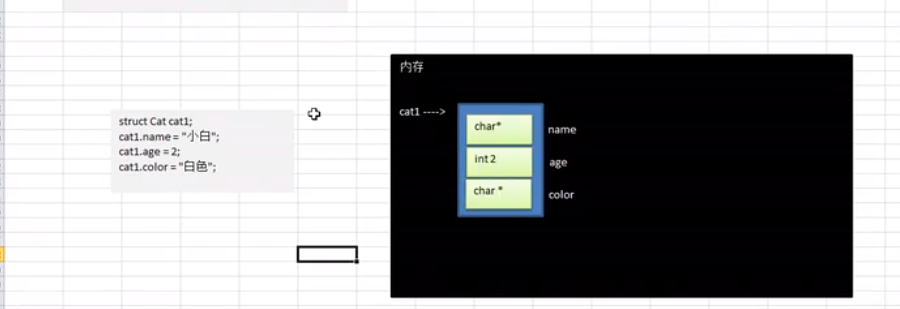
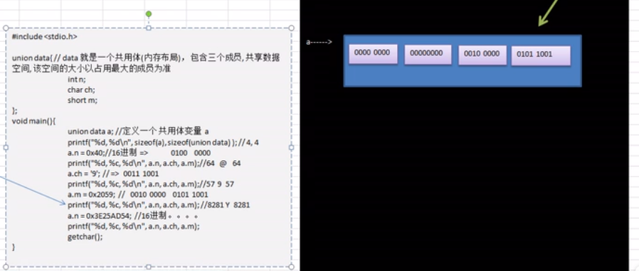

# c语言笔记 
[学习地址](https://www.bilibili.com/video/BV1qJ411z7Hf?p=149)
**1.hello world 输出**
```c
printf("hello world");
```
**2.输出1，2，3，4不重复出现的组合**
```c
void main() {
	//printf("hello world");
	int i, j, k;
	for (i = 1; i < 5; i++) {
		for (j = 1; j < 5; j++) {
			for (k = 1; k < 5; k++) {
				if (i != j && i != k && j != k) {
					printf("%d,%d,%d\n",i, j, k);
				}
			}
		}
	}
	getchar();
}

```
**3.企业发放的奖金根据利润提成.**  
	利润(I)低于或等于10万元时，奖金可提10% ；  
	利润高于10万元，低于20万元时，低于10万元的部分按10% 提成，高于10万元的部分，可提成7.5 % ；  
	20万到40万之间时，高于20万元的部分，可提成5 % ；  
	40万到60万之间时高于40万元的部分，可提成3 % ；  
	60万到100万之间时，高于60万元的部分，可提成1.5 % ；  
	高于100万元时，超过100万元的部分按1 % 提成。  
	从键盘输入当月利润I，求应发放奖金总数？
```c
void main() {
	//企业发放的奖金根据利润提成。

	//	利润(I)低于或等于10万元时，奖金可提10% ；
	//	利润高于10万元，低于20万元时，低于10万元的部分按10% 提成，高于10万元的部分，可提成7.5 % ；
	//	20万到40万之间时，高于20万元的部分，可提成5 % ；
	//	40万到60万之间时高于40万元的部分，可提成3 % ；
	//	60万到100万之间时，高于60万元的部分，可提成1.5 % ；
	//	高于100万元时，超过100万元的部分按1 % 提成。
	//	从键盘输入当月利润I，求应发放奖金总数？
	double i;
	double b = 0;
	printf("你的净利润是：\n");

	scanf_s("%lf", &i);
	if (i <= 100000) {
		b = i * 0.1; 
	}
	else if (i <= 200000) {
		b = 100000 * 0.1 + (i - 100000) * 0.075;

	}
	else if (i <= 400000) {
		b = 100000 * 0.1 + 100000 * 0.075 + (i - 200000) * 0.05;
	}
	else if (i <= 600000) {
		b = 100000 * 0.1 + 100000 * 0.075 + 200000 * 0.05 + (i - 400000) * 0.03;
	}
	else if (i <= 1000000) {
		b = 100000 * 0.1 + 100000 * 0.075 + 200000 * 0.05 + 200000 * 0.03 + (i - 600000) * 0.015;
	}
	else if (i > 1000000) {
		b = 100000 * 0.1 + 100000 * 0.075 + 200000 * 0.05 + 200000 * 0.03 + 400000 * 0.015 + (i - 1000000) * 0.01;
	}

	printf("提成为：bonus=%lf", b);

	printf("\n");
	getchar();
}
```

**4.符号**
```c
void main() {
	//1.\t制表符 
	//2.\n换行符  \r表示回车
	//3.\\ 第一个\转义符  第二个\表示输出内容
	//4.\" 第一个\转义符  第二个"表示输出内容
	printf("姓名\t年龄\t性别\t爱好\n1\t2\t3\t4  \n");
	printf("撒\n");
	printf("\\ \n");
	printf("\" \n");
	getchar();
}
```

**5.输出**
```c
void main() {
	int num = 1;
	double score = 2.0;
	char gender = 'A'; 
	char name[] = "科学上网";

	/**
	*变量表示一个存储区域(不同的数据类型，占用的空间大小是不一样的) 
	*整数%d
	*小数%f, 保留小数点数%f.2
	*字符%c
	*字符串%s
	*/
	printf("num = %d , score = %.2f , gender = %c ,name = %s",num,score,
	gender,name);

	getchar();
}
```
**6.整数类型**  
char	1 字节 -2的7次方	-128 到 127 或 0 到 255   2的8次方减一  
  有符号  负的2的7次方  正的2的7次方-1  
  无符号   0 到  2的8次方-1  
$
{-2^7 = 128}
$  
$
{2^7 -1= 127}
$  
$
{2^8 - 1 = 255}
$  
unsigned char	1 字节	0 到 255  
signed char	1 字节	-128 到 127  
int	2 或 4 字节	-32,768 到 32,767 或 -2,147,483,648 到 2,147,483,647  

unsigned int	2 或 4 字节	0 到 65,535 或 0 到 4,294,967,295  
short	2 字节	-32,768 到 32,767  
unsigned short	2 字节	0 到 65,535  
long	4 字节	-2,147,483,648 到 2,147,483,647  
unsigned long	4 字节	0 到 4,294,967,295  
**浮点数类型**  
float	4 字节	1.2E-38 到 3.4E+38	6 位小数  
double	8 字节	2.3E-308 到 1.7E+308	15 位小数  
long double	16 字节	3.4E-4932 到 1.1E+4932	19 位小数  
```c
void main() {

    float f = 5.12f;
	float f1 = .512f;
	double d = 5.12E2; //5.12*10^2
	double d1 = 5.12E-2;//5.12*10^-2

	printf("f = %f , f1 = %f , d = %f ,d1 = %f",
	f,f1,d,d1);
	getchar();
}
```
**char类型**
```c
void main() {
char c = 'a';
char c1 = 'A';

printf("c = %c , c1 = %c \n",c,c1);
printf("c = %d , c1 = %d ",c,c1);
getchar();
}
```
**bool类型**
```c
void main() {
    //0假 1 真
	int n = 1;
	if(n){
		printf("我是真的 \n");
	}else{
		printf("我是假的 \n");
	}
	getchar();
}
```

**基本数据类型转换**  
低精度自动转换高精度  
高精度 转 低精度 强制类型转换 造成精度损失 

```c
//类型转换
void main() {
    double n = 156.12;
	int num = (int)n;
	printf("num = %d \n",num);//直接截断小数，不是四舍五入
	getchar();
}

void main() {
    double n = 156.12;
	double db = (9*3.2+5*4.2);//28.8 + 21 = 49.8
	int num = (int)(9*3.2+5*4.2);//49
	printf("num = %d  db = %.2f\n",num,db);
	getchar();
}


void main() {
    char c = 'a';
	int t = 5;
	float f = .314f;
	double result = c + t + f;
	printf("强制转换 int  result = %d \n",(int)result); //102
	printf("强制转换 char result = %c \n",(char)result);//f
	printf("字符 result = %f \n",result);//102.314000
	printf("字符 result = %.2f \n",result); //102.31
	getchar();
}
```

## 指针  
1.指针是什么 --> 指针表示一个地址  
2.指针类型 要  和 值类型一致 比如 char *p --> char c; int *p --> int i  
3.数组指针，结构体指针 ,二级指针 多级指针
```c
void main() {
    char c = 'a';
	//如果要输出变量的地址，使用格式 %p
    //&c 表示 取出 'c变量' 内存地址
	printf("c = %c c内存地址 = %p \n",c,&c); 
	getchar();
}


void main() {
    char c = 'a';
	//char * 表示类型 为 指针类型
	//p 指向了 一个 char 类型的 内存地址
	char *p = &c;
	printf("c = %c 指针p = %p \n",c,p);  
	printf("p的地址 = %p \n",&p);  //指针p的地址
	getchar();
}

void main() {
    char c = 'a';
	//char * 表示类型 为 指针类型
	//p 指向了 一个 char 类型的 内存地址
	char *p = &c;
	printf("c = %c 指针p = %p \n",c,p);  
	 //指针p本身的地址
	printf("p的地址 = %p \n",&p); 
    //获取指针p指向的值
	printf("p指向的值 = %c \n",*p);
	getchar();
}

void main() {
   
    int i = 999;
    printf("i = %d \n",i); //999
	int *ptr = &i;
	*ptr = 666;
	printf("ptr = %p \n",ptr);//i的地址
	printf("i = %d \n",i);    //666
	printf("i = %d \n",*ptr); //666
	getchar();
}


void main() {
   
    int i = 999;
    printf("i = %d \n",i); //999
	int *ptr = &i;
	*ptr = 666;
	printf("ptr = %p \n",ptr);//i的地址
	printf("i = %d \n",i);    //666
	*ptr = 777;
	printf("i = %d \n",*ptr); //777
	getchar();
}
```
## 值传递 地址传递
1.默认传递值 -- 基本数据类型，结构体，共用体  i --> 地址 --> 值  传递值
2.默认传递地址 -- 指针和数组  i --> 地址 --> 地址 -->值 传递的是第二个地址
```c

void main() {
	
    int i = 999;
	int *ptr = &i; 
	int *p = ptr;
    int *pr = p;
	

	printf("i = %p *ptr = %p *p = %p\n",&i,ptr,p); 
	//i = 0061FF10 *ptr = 0061FF10 *p = 0061FF10
	printf("i = %d *ptr = %d *p = %d\n",i,*ptr,*p); 
	//i = 999 *ptr = 999 *p = 999
    printf("pr = %p pr = %d\n",pr,*pr);
	 //pr = 0061FF10 pr = 999
	getchar();
}


```

**练习**
```c
void main() {
	char name[10] = "爱情";
	int age  = 18;
	float score = 75.9f;
    char gender = 'M';
	char hobby[20] = "男朋友,女朋友";
	printf("姓名\t 年龄 \t 成绩 \t 性别 \t 爱好 \n%s \t %d \t %f \t %c \t %s \n",
	name,age,score,gender,hobby);
	//输出
	//姓名	 年龄 	 成绩 	 性别 	 爱好
    //爱情 	 18 	 75.900002 	 M 	 男朋友,女朋友

	getchar();
}


void main() {

	int i = 9;
	int i1 = 99;

    int sum = i + i1;
	int sub = i1 -i;
	int c = i1 * i;
	int c1 = i1 / i;

    printf("************************************\n");
	printf("********小小计算机**********\n");
	printf("************************************\n");

	printf("%d + %d = %d \n",i,i1,sum);
    printf("%d - %d = %d \n",i1,i,sub);
	printf("%d * %d = %d \n",i1,i,c);
	printf("%d / %d = %d \n",i1,i,c1);
	getchar();
}


void main() {
    int num =10;  

	if(num % 2 == 0 ){
 		printf("%d 是 偶数\n",num);
	}else{
		printf("%d 是 奇数\n",num);
	}
	getchar();
}
```
## 常量  
整型常量，字符常量,浮点型常量,字符串常量  
define 和 const  
1.const需要定义类型,define不需要  
2.const编译运行才生效,define 预处理阶段就生效了  


```c
void main() {
   //0x开头 16进制
    int num =0x12;  
     //0开头 8进制
    int num1 =0234;  
	//"\t字符常量"
	char c = '\t';
    //字符串常量 \转义符
	char c1[200] = "字符串常量";
	char c2[200] = "字符串 \\ 常量";
	printf("%d %d %d %s %s\n",num,num1,c,c1,c2);
	getchar();
}


#define WIDTH 10 //常量定义 define可以不加分号
#define HEIGHT 10
void main() {
  
	int s;
	s = WIDTH * HEIGHT;
	printf("ssss %d\n",s);
	getchar();
}


const int  LENGTH = 10;//const定义常量
const int  WIDTH  = 5;
void main() {
  
	int s;
	s = WIDTH * LENGTH;
	printf("s= %d\n",s);
	getchar();
}
```
3.define 只是简单替换  
4.const可以调试,define不可以调试  
```c
#define A 1
#define B A+1
#define D A/B*3

void main() {
  
   //define 只是一个简单的替换 A/B*3=A/A+1*3=1/1+1*3=1+3=4        
	printf("d = %d\n",D);
	getchar();
}

```
5.const不能重复定义,define通过undef取消某个符号的定义，再重新定义

```c
#define A 1
#define undef A
#define A 4

void main() {   
	printf("A = %d\n",A);//4
	getchar();
}
```

6.define可以配合 #ifdef,#ifndef,#endif来使用,比如通过#define来启动，关闭调试信息
```c
#define A

void main() {
  
    #ifdef A
       printf("ok,调试信息 \n");
	#endif

	#ifndef A
       printf("hello,其他信息 \n");
	#endif

	getchar();
}
```

## 算数运算符

1.除法
```c
void main() {
  
    int dub = 10 / 4;//int砍掉小数 = 2
	printf("dub=%d\n",dub);

    double dubb = 10.0 / 4;
	//如果希望保留小数,参与运算数必须带有浮点数,否则=2.0000
	printf("dubb=%.2f\n",dubb);//2.50

	getchar();
}
```

2.取模
```c
void main() {
   //10 % 3 = 10 - (10/3) * 3 = 10 - 3*3 = 10 - 9 = 1
   int i = 10 % 3;
   //10 % 4 = 10 - (10/4) * 4 = 10 - 2*4 = 10 - 8 = 2
   int i2 = 10 % 4;
    printf("i = %d i2 = %d\n",i,i2);
	getchar();
}
```

3.++,--
```c
void main() {
    int i = 10;
	int j = i++;
	//i++ 先赋值  再自增 j = 10; i = 11; ==> j = i ; i = i +1;
    printf("j = %d ,i = %d \n",j,i);
	int k = ++i;
	//++i先自增，再赋值， k = 12 ,i = 12; ==> i = i + 1; k = i;
	printf("k = %d ,i = %d \n",k,i);
	getchar();
}
```
### 练习  

```c
void main() {
   //97天放假，问，有多少个星期零多少天
   int i = 97;
   int day = i % 7;

   int week = i / 7;
   printf("还有%d周 ,零%d天放假  \n",week, day);

   getchar();
}

```
华氏温度转摄氏温度，注意要得到浮点数除法的小数
```c
void main() {
 
   double huashi = 200.0;

   double sheshi = 5.0/9.0*(huashi - 100);

   printf("%.2f华氏温度 = %.2f摄氏温度\n",huashi,sheshi);
   //200.00华氏温度 = 55.56摄氏温度
   getchar();
}
```

###关系运算符 > < == <= >= != 
```c

void main() {
   //假 为  0 ，真 为 非0 (默认为1)
   int a = 8;
   int b = 7;
   printf("a > b = %d\n",a>b);
   printf("a < b = %d\n",a<b);
   printf("a <= b = %d\n",a<=b);
   printf("a >= b = %d\n",a>=b);
   printf("a == b = %d\n",a==b);
   printf("a != b = %d\n",a!=b);
   getchar();
}
```

### 逻辑运算符 &&逻辑与运算符 ||逻辑或运算符 !逻辑非运算符
```c
void main() {
   //假 为  0 ，真 为 非0
   int a = 80;
  if(a > 70 && a < 90){
	  printf("ok,a 在70 与 90 区间内\n"); //输出
  }else {
	  printf("a不在70 与 90 区间内\n");
  }
    
   getchar();
}


void main() {
   //假 为  0 ，真 为 非0
   int a = 80;
   int i = 99;
  if(a < 100 && i++  > 99){
	  printf("ok100");
  }else {
	  printf("i = %d\n",i);//输出
  }
    
   getchar();
}
```
||逻辑或  
```c
void main() {
   //假 为  0 ，真 为 非0
   int a = 80;
   int i = 99;
  if(a < 100 || i++  > 99){
	  printf("ok100");//输出
  }else {
	  printf("i = %d\n",i);
  }
    
   getchar();
}
```

### 赋值运算符  = += *= /= %= 
1.= 把右边赋值给左边  
```c
void main() {
  
   int a = 80;
   int i = 99;
   
   int temp = a;
   a = i;
   i = temp;
   printf("a = %d,i = %d \n",a,i);//a = 99,i = 80
   getchar();
}
```
2.+= 
```c
void main() {

	int a = 3;
	a += 3;//a = a + 3
	printf("a = %d \n",a);//a = 6

	getchar();
}
```
3.*=

```c
void main() {

	int a = 3;
	a *= 3;//a = a * 3
	printf("a = %d \n",a);//a = 9

	getchar();
}
```

### 三元运算符   
1.条件表达式?表达式1:表达式2   
2. 表达式为真返回1，为假返回2  

```c
void main() {
	int a = 3;
    int b = 4;
	int res = a > b ? a : b; //返回最大值
	printf("res  = %d \n",res);//res = 4

	getchar();
}
```
练习，取最大值
```c

void main() {
	int a = 3;
    int b = 4;
	int c = 8;
	int res = a > b ? a : b;  
	// 如果a大于b,返回a,否则返回b
	int m = res > c ? res : c; 
	// 如果rec大于c,返回res,否则返回c
	printf("m  = %d \n",m); //8

	getchar();
}
```
   
### 运算符优先级
1.三个从右向左  赋值运费符，单目运算，三目运算  
2.其他从左向右  
3.逗号运算符优先级最低   
4.优先级的大概顺序,算数>关系>逻辑(逻辑非除外)>赋值>逗号  
5.?怎么用


### 控制台输入scanf
```c

void main() {
      char name[100] = "";
      printf("you age \n");
      scanf("%s",&name);
      printf("you age is %s\n",name);
      getchar();
      getchar();	
}
```

###  练习

 1.x秒 转换x小时x分钟x秒
 ```c
void main() {
      //秒 = x小时x分钟x秒
      int second = 99999;
      int hour = second / 3600;
      int min = second % 3600 / 60;
      int leftSecond = second % 60;
      printf("%d秒 == %d小时%d分钟%d秒 \n",second,hour,min,leftSecond);
      getchar();	
    
}
 ```
 2.实现3个数排序,按照从小到大排序
 ```c
 void main() {
    int n1 = 9;
    int n2 = 8;
    int n3 = 7;
    int temp = 0;
    if(n1 > n2){
          temp = n2;
          n2 = n1;
          n1 = temp;
    }
     printf("第一次交换的顺序%d%d%d\n",n1,n2,n3);
      if(n2 > n3){
            temp = n3;
            n3 = n2;
            n2 = temp;
      }
      printf("第二次交换的顺序%d%d%d\n",n1,n2,n3);
       if(n1 > n2){
          temp = n2;
          n2 = n1;
          n1 = temp;
       }
      printf("第三次交换的顺序%d%d%d\n",n1,n2,n3); 
}
 ```
 ## 二进制和位运算  
 ### 进制
 1.二进制  满二进1  所以只有0和1  
 2.十进制  满十进一 所以只有0-9  
 3.八进制  满八进一 所以只有0-7 
 4.十六进制 满十六进一    
 所以只有0-9 A-F A->10 B->11 C-12 D-13 E-14 F-15  

 ### 进制转换  
 #### 其他进制转十进制 x进制 yyy = y*x^0 + y*x^1 + y*x^2
 1.二进制转十进制 
 ```c
 //二进制转10进制  规则，从低位开始 乘以2的位数-1次方 
 //每一位相加的和
 //1000  0*2^0 + 0*2^1 + 0*2^2 + 1*2^3 = 0+0+0+8 = 8
 ```
2.八进制转十进制 
 ```c
 //8进制转十进制 规则,从低位开始，乘以8的位数-1次方
//每一位相加的和
 //107  7*8^0 + 0*8^1 + 1*8^2 = 7+0+64 = 71
 ```
 3.十六进制转十进制
 ```c
 //十六进制转十进制 规则，从低位开始，乘以十六的位数-1次方
//每一位相加的和
 //0xA8 8*16^0 + 10*16^1 = 8 + 160 = 168
 ```
### 十进制转其他进制  除以该进制,直到商为0 ,将得到的余数倒转
1.十进制转二进制
```c
//规则，将该数不断的除以2，直到为商0，然后将每步得到的余数倒转 
//56   56/2 = 28    0
//28   28/2 = 14    0
//14   14/2 = 7     0
//7    7/2  = 3     1
//3    3/2  = 1     1
//1    1/2  = 0     1
//56 = 111000
```
2.十进制转八进制
```c
//规则,将该数不断的除以8,直到商为0，然后将每步的余数倒转
//76 76/8 = 9   4
//9  9/8  = 1   1
//1  1/8  = 0   1
//76 = 114
```
3.十进制转16进制
```c
//规则,将该数不断的除以16,直到商为0，然后将每步的余数倒转
//56 56/16 = 3  8
//3  3/16  = 0  3

//56 = 38


//999 999/16 = 62   7
//62  62/16 =  3    E
//3   3/16 = 0      3

//999 = 3E7
```
 ### 二进制转其他进制  
 1.二进制转八进制
 ```c
 //二进制转八进制 
 //110110 三位一组转为10进制 110-5  110-5  066

 //1 110 010 110  110=6 010=2 110=6 1=1   1626
 ```
 2.二进制转16进制
 ```c
 //二进制转16进制
//四位一组转10进制
 //110110  0110=6 11=3  0x36

//111 0010 1110  = 72E
//1110 = 0 + 1*2^1 + 1*2^2 + 1*2^3 =0+2+4+8=14(E)
//0010 = 2
//111 = 1*2^0 + 1*2^1 + 1*2^2 =1+2+4=7

 ```

 ### 其他进制转二进制  
 1.八进制转二进制
 ```c
 //将八进制的每一位转为  一个 3位的二进制数
 //0237 = 010 011 111
 //7 = 7/2 = 3 余 1   
 //3 = 3/2 = 1 余 1
 //1 = 1/2 = 0 余 1
 //7 = 111
 //3 = 011
 //2 = 010
 ```
 2.16进制转二进制
 ```c
 //将16进制的每一位转为 一个 4位的二进制数
 //0x66  = 0110 0110
 //6 6/2 = 3 余 0
 //3 3/2 = 1 余 1
 //1 1/2 = 0 余 1 
 //6 = 0110
  
 ```
### 二进制的原码，反码，补码  （重要？）
1.二进制最高位为符号位，0表示正数，1表示负数  
2.整数的原码，反码，补码都一样  
3.负数的反码 = 原码的符号位不变，其他位取反  
4.负数的补码 = 反码 + 1  
5.0的 原码，反码，补码 都是0  
6.计算机的运算，都是以 **补码的方式** 来运算的  

### 位运算符  
1.& 按位与 0&0 = 0 0&1 = 0 1&0=0 1&1=1  
2.| 按位或 0|0 = 0 0|1 = 1 1|0=1 1|1=1   
3.^ 异或运算符 0^0 = 0 0^1 = 1  1^0 = 1 1^1 = 0  
4.~ 取反 ~0 = 1 ~1 = 0  
5.<< 二进制左移运算符 ，将一个二进制全部左移若干位(左边去掉，右边补0)  
6.>> 二进制右移运算符,将一个二进制全部右移若干位(右边去掉，左边 正数补0，负数补1)    
  
### 练习  
1.~2  
```c
// ~2 00000000 00000000 00000000 00000010 //补码取反
//    11111111 11111111 11111111 11111101 //负数的补码 
//反码11111111 11111111 11111111 11111100 = 补码- 1   
//原码10000000 00000000 00000000 00000011 = 符号位不变,其他取反
//   
   int a = ~2;
   printf("a = %d \n",a);
   getchar(); 
```
2.2&-3 
```c
//2的补码 00000000 00000000 00000000 00000010

//-3的原码10000000 00000000 00000000 00000011
//-3的反码11111111 11111111 11111111 11111100
//-3的补码11111111 11111111 11111111 11111101
//2& -3
//2         00000000 00000000 00000000 00000010
//-3        11111111 11111111 11111111 11111101
//2&-3      00000000 00000000 00000000 00000000
   int a = 2&-3;
   printf("a = %d \n",a);
   getchar();
```
3.~-5
```c
//~-5
//-5的原码    10000000 00000000 00000000 00000101
//-5的反码    11111111 11111111 11111111 11111010
//-5的补码    11111111 11111111 11111111 11111011
//-5的补码取反00000000 00000000 00000000 00000100
//~-5=4
   int a = ~-5;
   printf("a = %d \n",a);
   getchar();
```
4.2|3 
```c
//2|3 
//2   00000000 00000000 00000000 00000010
//3   00000000 00000000 00000000 00000011
//2|3 00000000 00000000 00000000 00000011 
//2|3 = 3
  int a = 2|3;
   printf("a = %d \n",a);
   getchar();
```

5.2^3 
```c
//2^3 
//2   00000000 00000000 00000000 00000010
//3   00000000 00000000 00000000 00000011
//2^3 00000000 00000000 00000000 00000001
//2^3 = 1
   int a = 2^3;
   printf("a = %d \n",a);
   getchar();
```

6.1>>2
```c
//1>>2 左移2位 
// 二进制右移运算符,将一个二进制全部右移若干位(右边去掉，左边 正数补0，负数补1)    
//1    00000000 00000000 00000000 00000001
//     00000000 00000000 00000000 00000000
//1>>2 = 0
void main() {
   int a = 1>>2;
   printf("a = %d \n",a);
   getchar();
}
```  
7.-1>>2 
```c
//-1 >> 2
//-1的原码   10000000 00000000 00000000 00000001 
//-1的反码   11111111 11111111 11111111 11111110
//-1的补码   11111111 11111111 11111111 11111111 补码-反码+1
//右移两位   11111111 11111111 11111111 11111111
//反码       11111111 11111111 11111111 11111110
//原码       10000000 00000000 00000000 00000001
//-1 >> 2 == -1


void main() {
   int a = -1>>2;
   printf("a = %d \n",a);
   getchar();
}
```

8.1<<2 
```c
//1<<2
//左移两位，右边补0 左边去掉
//1         00000000 00000000 00000000 00000001
//          00000000 00000000 00000000 00000100
//1<<2 = 4  
void main() {
   int a = 1<<2;
   printf("a = %d \n",a);
   getchar();
}
```  
9.-5&6
```c
//-5&6
//-5的原码 10000000 00000000 00000000 00000101
//-5的反码 11111111 11111111 00000000 11111010
//-5的补码 11111111 11111111 11111111 11111011
//6的补码  00000000 00000000 00000000 00000110
//-5&6     00000000 00000000 00000000 00000010
//-5&6 = 2
void main() {
   int a = -5&6;
   printf("a = %d \n",a);
   getchar();
}
```

9.-5|6
```c
//-5&6
//-5的原码 10000000 00000000 00000000 00000101
//-5的反码 11111111 11111111 00000000 11111010
//-5的补码 11111111 11111111 11111111 11111011
//6的补码  00000000 00000000 00000000 00000110
//-5|6     11111111 11111111 11111111 11111111
//负数的补码=反码-1
//         11111111 11111111 11111111 11111110
//负数的原码=反码取反，符号不变
//         10000000 00000000 00000000 00000001
//-5|6 = -1


void main() {
   int a = -5|6;
   printf("a = %d \n",a);
   getchar();
}

```

## 流程控制(顺序控制 分支控制 循环控制)
### 顺序控制,从上往下依次执行  
### 分支控制 
1.单分支控制
```c
//单分支控制 

void main() {
      int a = 1;
      printf("please age ");
      scanf("%d",&a);
      if(a >= 18){
      printf("a = %d \n",a);
      }


    getchar();
    getchar();
}
```

2.双分支控制
```c
//双分支控制 

void main() {
      int a = 1;
      printf("please age ");
      scanf("%d",&a);
      if(a >= 18){
      printf("a = %d \n",a);
      }else{
      printf("a < 18  \n");
      }
    getchar();
}
```
### 练习 
```c
void main() {
      int a = 1;
      int b = 81;
      if(a + b >= 18 && a+b < 30){
      printf("a = %d \n",a+b);
      }else if(a + b > 60){
      printf("a = %d \n",a+b);
	  }else{
      printf("a < 18  \n");
      }
    getchar();
}
```
3.多分支  
```c
void main() {
     
      double a = 0.0;
      printf("plase score \n");
      scanf("%lf",&a);
      if(a  > 90){
        printf("\nget BMW");
      }else if (a > 80)      {
        printf("\nget iphone");
      }else if (a > 60)      {
        printf("\nget wanju");
      }else {
        printf("\n no jiangli");
      }
    getchar();
    getchar();
}
``` 

### switch 分支 
```c
//输入月份，显示季节
void main() {
      int  a = 1;
      printf("Please enter month \n");
      scanf("%d",&a);
    switch (a){
    case 1:
    case 2:
    case 3:
          printf(" It's spring \n");
      break;
    case 4:
    case 5:
    case 6:
           printf(" It's summer \n");
    break;
    case 7:
    case 8:
    case 9:
          printf(" It's autumn \n");
      break;
    case 12:
    case 10:
    case 11:
          printf(" It's winter \n");
    break;
    default:
      break;
    }
    getchar();
    getchar();
}
```  
## 循环 控制
1.多次输出,循环控制
```c
//从0到8 依次输出
//0 number
//1 number
//2 number
//3 number
//4 number
//5 number
//6 number
//7 number
//8 number
void main() {
    for( int i = 0 ; i < 9 ; i++){
          printf("%d number\n",i);
    }
    getchar();
}
```  
2.多条初始化语句，循环变量迭代多条语句
```c
void main() {
    for( int i = 0 , j = 0 ; i < 9 ; i ++ , j = i * 2){
          printf("i = %d ; j= %d\n",i,j);
    }
    getchar();
}
```
1.练习
```c
void main() {
   
   //1-100内 9的倍数相加，以及个数
   int i = 0;
   int num = 0;
   int total = 0;
   for(i = 1 ;i < 100 ; i++){
       if(i % 9 == 0){
         num++;
         total = total + i;
       }
   }
   printf("1 - 100 内9的倍数相加 %d,9的倍数 的 个数%d\n",total,num);
    getchar();
}
``` 
```c
void main() {
   
  //0-num 相加等于num的组合
  for( int i = 0; i < 6; i++) {
    printf("%d + %d = %d \n",i,(6-i),6);
  }
    getchar();
}
```
## while循环 
1.用while循环输出1-9 
```c
void main() {
    int i = 1;
    while (i <= 9)
    {
      printf("%d\n",i);
      i++;
    }
     getchar();
}

```
### 练习 
1.输出1-100能被3整除的数
```c
void main() {
    int i = 1;
    while (i <= 100)
    {
      if(i%3 == 0){
      printf("%d\n",i);
    }
      i++;
    }
     getchar();
}
```
2.在控制台输出名字，直到输入exit退出
```c
#include <stdio.h>
#include <string.h>
void main() {
    char i[10] = "" ;
    while (strcmp(i, "exit")!=0)
    {
      printf("\nPlease enter a name\n");
      scanf("%s",i);
      printf("you name %s\n",i);
    }
     getchar();
}
```
## do{循环语句,循环变量迭代}while(循环条件)  循环控制 
```c
void main() {
  
     int i = 0;//循环变量初始化
     do{
      printf("%d\n",i);//循环体
      i++;//循环变量迭代
     }while(i<9);//循环条件
     getchar();
}
``` 
##练习
```c
void main() {
     //1-800相加的和
     int i = 0;//循环变量初始化
     int num = 0;
     do{
    //  printf("%d\n",i);//循环体
      num = num + i;
      i++;//循环变量迭代
     }while(i<=800);//循环条件 
     printf("%d \n",num);
     getchar();
}

```

```c
#include <stdio.h>
#include <string.h>
void main() {
    //一直输入,直到输入n退出
     char s[10] = "";
     do{
  
      printf("i like gowu   y/n");
      scanf("%s",s);
      getchar();  
     }while(strcmp(s, "n") !=0);//循环条件
   

     getchar();
}

```

```c
void main() {
    //1-100内能被5整除，但不能被3整除
     int i = 0;
     do{
      if(i % 5 == 0 && i % 3 != 0){
          printf("%d\n",i);
      }
      i++;
     }while(i<=100);//循环条件
   

     getchar();
}

```
### 嵌套循环
```c
void main() {
     //统计3个班的学生成绩，求各个班的平均成绩，和5个班的平均成绩
     //班级的个数classNum,每个班级的人数stuNum
     //各个班的总分classTotalNum
     //score学生成绩
     //各个班的总平均成绩 
     //及格人数
     int stuNum = 5;
     int classNum = 3;
     int classtotalNum=0;
     int  classtotalNums=0;
     int score = 0; 
     int i,j;
     int jige = 0;
     for(i=0;i<classNum;i++){
         classtotalNum = 0;
         for ( j = 0; j < stuNum; j++) {
            printf("di %d ban ji di %d ge xue sheng\n",i,j);
            scanf("%d",&score);
            classtotalNum += score;
            if(score > 60){
              jige++;
            }
         }
         printf("di %d ban ji ping jun fen =%d\n",i,classtotalNum / stuNum);
        classtotalNums += classtotalNum;

     }
    printf("ji ge ren shu =%d\n",jige);
    printf("zong ping jun fen =%d\n",classtotalNums / (stuNum*classNum));

     getchar();
     getchar();
}

```
### 九九乘法表
```c
void main() {
   //打印99乘法表
   for (int i = 1;i <= 9;i++){
        for (int j = 1;j <= i;j++){
       printf("%d * %d = %d \t",j,i,i*j);
    }
     printf("\n");
   }
     getchar();
}

```

```c
//长方形
//******
//******
//******
//******
//******
void main() {
   for (int i = 1;i <= 5;i++){
 
      for (int j = 1;j <= 5;j++){
          printf("*");
      }
        printf("\n");
   }
     getchar();
}
//星号
//*
//**
//***
//****
//*****
void main() {
   for (int i = 1;i <= 5;i++){
 
      for (int j = 1;j <= i;j++){
          printf("*");
      }
        printf("\n");
   }
     getchar();
}


//没有空格的金字塔 (2*i)-1 星号的数量
//*
//***
//*****
//*******
//*********
void main() {
   for (int i = 1;i <= 5;i++){
 
      for (int j = 1;j <= (2*i)-1;j++){
          printf("*");
      }
        printf("\n");
   }
     getchar();
}
//金字塔 5-i=空格数
//    *
//   ***
//  *****
// *******
//*********
void main() {
   for (int i = 1;i <= 5;i++){
       for (int k = 1;k <= 5-i;k++){
          printf(" ");
      }
      for (int j = 1;j <=(2*i)-1;j++){
          printf("*");
      }
        printf("\n");
   }
     getchar();
}

//空心金字塔
    *
   * *
  *   *
 *     *
*********

void main() {
   for (int i = 1;i <= 5;i++){
       for (int k = 1;k <= 5-i;k++){
          printf(" ");
      }
      for (int j = 1;j <=(2*i)-1;j++){
          if(i==1 || i==5 || j == 1 || j == (2*i)-1){
             printf("*");
          }else{
            printf(" ");
            }
      }
        printf("\n");
   }
     getchar();
}


void main() {
    //输入任意数字打印空心金字塔
    int num =5;
    printf("plase * num\n");
    scanf("%d",&num);
   for (int i = 1;i <= num;i++){
       for (int k = 1;k <= num-i;k++){
          printf(" ");
      }
      for (int j = 1;j <=(2*i)-1;j++){
          if(i==1 || i== num || j == 1 || j == (2*i)-1){
             printf("*");
          }else{
            printf(" ");
            }
      }
        printf("\n");
   }
     getchar();
     getchar();
}

```
## break 结束当前循环
```c
void main() {
  
    for(int i=0;i<5;i++){
      for(int j=1;j<5;j++){
        if(j==2){
           break;
        }
        printf("i = %d\n",i);
      }
    }
     getchar();
}

//i=0
//i=1
//i=2
//i=3
//i=4
```
1.登录验证，3次机会，输入hello 登录成功，否则显示还剩余几次机会
```c
void main() {
     int channce = 3;
     int j =3;
     char name[10] = "";
     for(int i=1;i<=3;i++){
          printf("plase you name\n");
          scanf("%s",name);
          if(strcmp("hello",name) == 0){
           printf("success");
           break;
          }else{
              channce--;
              printf("hai sheng %d ci\n",channce);
            if(channce<=0){
              break;
            }
          }
     }
       getchar();
       getchar();
}

```

## continue 结束本次循环
```c
void main() {
   
     for(int i=1;i<=5;i++){
       if(i==3){
         continue;
       }
       printf("%d\n",i);
     }
       getchar();
}

```
1.从键盘输入数字，记录负数和正数的个数，输入0时退出循环
```c
void main() {
   
      int p = 0;//正数的个数
      int n = 0;//负数的个数
      int num = 0;
      for (;;){//表示死循环，永远不退出
      printf("plase enter  num\n");
      scanf("%d",&num);
        if(num == 0){
          break;
        }
        if(num < 0){
          n++;
          continue;
        }
         if(num > 0){
          p++;
           continue;
        }
      }
      printf("zheng shu ge shu= %d fu shu ge shu =  %d",p,n);
    getchar();
    getchar();
}

```
2.100000人民币可以过多少个路口,50000以上收5%，以下收1000
```c
void main() {
   int lukou = 0;
    int tom = 100000;
    while(1){
      if(tom < 1000){
        break;
      }
      if(tom>50000){
        tom = tom *0.95;
      }else{
        tom = tom - 1000;
      }
      lukou++;

    }
    printf("100000 RMB ke yi jing guo %d ge lu kou\n,sheng yu %d RMB\n",lukou,tom);
    getchar();
}

```

## goto语句 和 return 语句 
1.goto想去哪就去哪 goto lable
```c
void main() {
printf("0000");
goto lable1;
printf("0000\n");

printf("100000 RMB ke yi jing guo %d ge lu kou\n,sheng yu %d RMB\n",1,2);

lable1:
getchar();
}

```

2.水仙花数
```c
void main() {
for(int i=100;i<1000;i++){
  //水仙花数 各个位数的3次方 相加 等于本身
  int b = i / 100; //百位数
  int s = i % 100 /10; //十位数
  int g = i % 10; //个位数
  if(g * g * g + s * s * s +b * b * b == i){
        printf("%d is shui xian hua shu\n",i);
  }
}
getchar();
}

```

## enum枚举 

```c
enum DAY{
  one=1,two ,three ,si ,wu ,liu,qi,ba,jiu
}day;
void main() {
for(day = one;day<jiu;day++){
  printf("%d\n",day);
}
getchar();
}

```

## 函数
解决传统方法代码冗余问题  
不利于维护  
引出函数

完成某一功能的程序指令的集合  

1.函数的递归实验

```c
//依次输出 n = 2, n = 3 , n = 4  
//
void getTest(int n){
  if(n>2){
    getTest(n-1);
  }
  printf("n = %d\n",n);
}
void main() {
 

  getTest(4);
  getchar();
}
```
2.使用斐波拉系数,1,1,2,3,5,8,13给你一个整数，求出他的斐波拉系数
```c
int  getTest(int n){
  if(n == 1|| n == 2 ){
    return 1; 
  }else{
    return getTest(n - 1) + getTest(n - 2);
  }
  
}
void main() {
 //使用斐波拉系数,1,1,2,3,5,8,13给你一个整数，求出他的斐波拉系数
 //使用递归

  int res =  getTest(7);
  printf("res = %d\n",res);
  getchar();
}

```

3.已知f(1) = 3,f(n)=2*f(n-1)+1
```c
int  getTest(int n){
 if(n == 1){
   return 3;
 }else{
   return 2 * getTest(n-1) + 1;
 }
}
void main() {
  //已知f(1) = 3,f(n)=2*f(n-1)+1
  int res =  getTest(7);
  printf("res = %d\n",res);
  getchar();
}
```
4.猴子吃桃,吃一半 ，在多吃一个，第十天只剩一个，求一共有多少个桃子
```c
int  getTest(int n){
 if(n == 10){
   return 1;
 }else{
   return 2 * (getTest(n+1)+1);
 }
}
void main() {
  //猴子吃桃,吃一半 ，在多吃一个，第十天只剩一个，求一共有多少个桃子
  //第九天 (1 + 1)*2
  int res =  getTest(9);
  printf("res = %d\n",res);
  getchar();
}

```
## 函数的值传递，和地址传递  
1.地址传递效率高，值的传递 值的大小决定效率的高低，越大效率越低  
2.地址传递/引用传递  默认的有指针和数组  
3.值传递 默认的有基本数据类型，结构体，共用体，枚举类型 

## 变量的作用域  
1.函数的内部声明/局部变量,作用域只在函数内部生效  
2.函数的局部变量，与全局变量相同，函数采用就近原则,取函数内部变量  
3. 在一个代码块中,变量的作用域只在该代码块 有效
4. 函数外部的变量--全局变量，作用域在整个程序有效

## 变量初始化注意事项  
1.局部变量 系统不会初始化 ， 必须程序员给其初始值，否则会异常退出  
2. 全局变量 系统会自动初始化 int 0 char '/0' float 0.0 double 0.0   
## 变量作用域  
1.全局变量 保存在内存的全局存储中,占用静态存储单元，作用域整个程序  
2.局部变量 保存在内存栈中  
3.c程序规定，只能从变量作用域小向变量作用域的大寻找  
4.同一作用域 变量名不能重复  
5.代码块也有独立的作用域
## C内存布局
1.栈区---局部变量  
2.堆区---函数动态分配的数据，放在堆  
3.静态存储区/全局区--存储全局变量，静态变量  
4.代码区--存放代码/指令  
## static 关键字  
1.局部变量加 static 关键字 -- 静态局部变量，自动初始化  
2.静态局部变量存储在静态存储区,只会初始化一次,即使函数返回/销毁，它的值保持不变  
```c
void fn(){
static int n = 3;
printf("n = %d\n",n);
n++;
printf("n = %d\n",n);
}
void main() {
  fn();// 3 ,4
  printf("\n");
  fn();//4,5
  getchar();
}
```
3.静态全局变量 -- 只能在当前文件使用,其他文件不能访问  使用了#include 可以访问


## 常用字符串函数
```c
#include <stdio.h>
#include <string.h>
int main() {
//常用字符串函数 

  char dest[50] = "cccc";
  char desc[50] = " world";
  //拷贝 替换前面的字符串
  strcpy(dest,"hello");
  printf("dest = %s\n",dest);
  //获取字符串长度
  printf("dest长度 = %d\n",strlen(dest));
  //连接两个字符串
  strcat(dest,desc);
  printf("desc = %s\n",dest);
  getchar();
}
```
## 常用时间日期相关函数 time.h  
```c
#include <stdio.h>
#include <string.h>
#include <time.h>
void getTest(){
  for(int i= 0;i<100;i++){
   for(int j= 0;j<100;j++){
     printf("%d %d\n",i,j);
  }
  }
}
int main() {
//常用 时间 日期 函数
  time_t curtime,end_time; //time_t 结构体
    time(&curtime);//完成初始化
  double s;

  //ctime(&curtime)返回一个当地的时间
 // printf("%s\n",ctime(&curtime));
   getTest();
   time(&end_time);//完成初始化
   s = difftime(end_time,curtime);
   printf("%.3lf \n",s);
  getchar();
}
``` 
## 基本数据类型和字符串互转 
```c
#include <stdio.h>
#include <string.h>
#include <time.h>

int main() {

  char str1[20];
  char str2[20];
  char str3[20];
  //基本数据类型转字符串
  sprintf(str1,"%d",333);
  sprintf(str2,"%.2f",333.6);
  sprintf(str3,"%8.2f",333.66);
  printf("str1 = %s str2 = %s str3= %s\n",str1,str2,str3);
  getchar();
}

```


```c
#include <stdio.h>
#include <string.h>
#include <stdlib.h>

int main() {

  char str1[20] = "9999";
  char str2[20] = "66.0";
  char str3[20] = "bf";
  //基本数据类型转字符串

  int num1 = atoi(str1);
  double num2 = atof(str2);
  char num3 = str3[0];

  printf("%d,%f,%c \n",num1,num2,num3);
  getchar();
}

```

## 预处理命令
```c
#include <stdio.h>
#include <string.h>
#include <time.h>
#if _WIN32 //如果是windows，调用windows.h
#include <windows.h>
#elif __linux__ //如果是linux，调用unistd.h
#include <unistd.h>
#endif
int main() {
  //预处理命令
   #if _WIN32
   Sleep(5000);//毫秒
   #elif __linux__
   sleep(5);//秒
   #endif
   printf("hello c world");
   getchar();
}
```
### 宏定义#define c语言预处理命令的一种,用一个标识符表示一个字符串，如果出现该标识符，那么全部替换成指定的 字符串

```c
#include <stdio.h>
#include <string.h>
#include <time.h>
#define N  100
int main() {
  //预处理命令
   int c = 100 + N;
   printf(" c  = %d",c);
   getchar();
}

```
### 宏定义案例
```c
#include <stdio.h>
#include <string.h>
#include <time.h>
#define N  (n*n+3*n)
int main() {
  //预处理命令
  int sum,n;
  printf("shu ru n\n");
  scanf("%d",&n);
   sum = 3*N+4*N+5*N;
   printf(" sum  = %d",sum);
   getchar();
   getchar();
}
``` 
1.宏定义注意事项，只是简单替换，包括if语句，函数，表达式,常量，字符串，在预处理的时候不被检查，如有错误，在编译已被宏展开后的源程序发现  
2.要写在函数外，如要终止作用域，用undefine  
3.如被双引号，则不会替换  
4.允许嵌套,宏定义的字符串可以使用已被定义的宏，在宏展开后由预处理程序层层替换  
5.宏名习惯大写字符表示  
6.可用宏定义表示数据类型，使书写方便  
7.宏定义与typedef的区别，宏定义只是简单的替换，由预处理器处理，而typedef是在编译阶段由编译器处理，它是给原有数据类型起一个新的名字，将他作为一个新的数据类型  
8.宏定义不需要加分号,如加上分号则连分号一起替换  

### 带参数的宏定义
```c
#include <stdio.h>
#include <string.h>
#include <time.h>
#define MAX(a,b) (a>b)?a:b
int main() {
  //预处理命令
   int x,y;
   printf("shu ru x , y\n");
   scanf("%d %d",&x,&y);

   printf("max = %d\n",MAX(x,y));
   getchar();
   getchar();
}
``` 
1.带参数的宏定义不会为参数分配内存，所以不必带数据类型  
2.带参宏调用:宏(实际参数)  

### 带参数宏定义和函数的区别  
1.宏 只是简单的替换，不会对表达式计算，宏在编译之前就被处理掉了，它没有机会参与编译,不会占用内存.  
2.函数是一段会被重复使用的代码，会被编译，占用内存，每次调用函数，就是执行这块内存中的代码  
```c
#include <stdio.h>
#include <string.h>
#include <time.h>
#define MAX(a) (a)*(a)

int getMax(int a){
  int  max =(a)*(a);
  return max;
}
int main() {
  //预处理命令
   int i = 1;
   while(i<=5){
   printf("%d^2 = %d\n",i,getMax(i++));
   }
   //函数运算
// 2^2 = 1
// 3^2 = 4
// 4^2 = 9
// 5^2 = 16
// 6^2 = 25
   printf("\n");
   int a = 1;
   while(a<=5){
       printf("%d * %d = %d\n",a-2 , a - 1,MAX(a++));
   }
//宏定义运算
// 1 * 2 = 2
// 3 * 4 = 12
// 5 * 6 = 30
   getchar();
}
```
# 数组  
1.数组可用存放多个相同数据类型，是构造类型，传递是地址(指针传递)  
```c
#include <stdio.h>
int main() {
//数组
   double hens[6];
   hens[0] = 3.0;
     hens[1] = 3.1;
       hens[2] = 3.2;
         hens[3] = 3.3;
           hens[4] = 3.4;
             hens[5] = 6;
               hens[6] = 3.6;
    double totalWeight = 0.0;
    double avgWeight = 0.0;
    // sizeof(hens)数组总大小
    //sizeof(double);//返回一个double占用字节数
    int  arrLen =  sizeof(hens)/sizeof(double);//数组个数
    for (int i=0;i<arrLen;i++){
      totalWeight+=hens[i];
    }           
    avgWeight = totalWeight / arrLen;
    printf("arrLen = %d totalWeight = %lf , avgWeight = %lf"
    ,arrLen,totalWeight,avgWeight);
   getchar();
}
```
```c
#include <stdio.h>
int main() {
//数组
   double hens[6];
   hens[0] = 3.0;
     hens[1] = 3.1;
       hens[2] = 3.2;
         hens[3] = 3.3;
           hens[4] = 3.4;
             hens[5] = 6;
    double totalWeight = 0.0;
    double avgWeight = 0.0;
    // sizeof(hens)数组总大小
    //sizeof(double);//返回一个double占用字节数
    int  arrLen =  sizeof(hens)/sizeof(double);//数组个数
    for (int i=0;i<arrLen;i++){
      totalWeight+=hens[i];
      printf("hens[%d] == %lf\n",i,hens[i]);
      printf("address = %p\n",&hens[i]);//地址
    }           
    avgWeight = totalWeight / arrLen;
    printf("arrLen = %d totalWeight = %lf , avgWeight = %lf",arrLen,totalWeight,avgWeight);
   getchar();
}
```
2.数组的3种初始化方式
```c
#include <stdio.h>
int main() {
//数组
   double hens[6];
   hens[0] = 3.0;
     hens[1] = 3.1;
       hens[2] = 3.2;
   
    double henss[3]= {1,2,3};
    double hensss[]= {1,2,3,4};
    getchar();
}
```
### 注意事项,数组传递的是地址，操作数组变量会改变原数组 
```c
#include <stdio.h>
void getHens(double hen[]){
  hen[0] = 100;
  hen[3] = 20;
  hen[4] = 50;
  hen[5] = 60;
}
int main() {
//数组
   char hens[26];
   hens[0] = 3.0;
     hens[1] = 3.1;
       hens[2] = 3.2;
   
       getHens(hens);
     int  arrLen =  sizeof(hens)/sizeof(double);//数组个数
    for (int i=0;i<arrLen;i++){
      printf("hens[%d] == %lf\n",i,hens[i]);
      printf("address = %p\n",&hens[i]);//地址
    } 
    getchar();
}
```

### 练习
1.将A-Z放入数组，并显示
```c
#include <stdio.h>

void getHens(char hen[]){
 for(int i = 0;i < 26;i++){
   hen[i] = 'A' + i;
 }
}
int main() {
//数组
    char hens[26];
    getHens(hens);
     int  arrLen =  sizeof(hens)/sizeof(char);//数组个数
    for (int i=0;i<arrLen;i++){
      printf("hens[%d] == %c\n",i,hens[i]);
      printf("address = %p\n",&hens[i]);//地址
    } 
    getchar();
}
```  
2.取出数组的最大值，和最大值的下标
```c
#include <stdio.h>
int main() {
//数组
    int  hens[6] = {1,2,3,100,5,66};
    int  arrLen =  sizeof(hens)/sizeof(int);//数组个数
    int max = 0;
    int maxLeng = 0;
    for (int i=0;i<arrLen;i++){
     if(hens[i]>max){
       max = hens[i];
       maxLeng = i;
     }
    } 
    printf("max = %d ,maxLeng = %d",max,maxLeng);
    getchar();
}
```
### 字符数组，用来存放字符的数组
1.一系列字符的集合,也就是字符串  
```c
#include <stdio.h>
int main() {
//数组
    char c[20] = {'a','b','c','d'};
    printf("%s",c);
    getchar();
}
```  
### 字符串注意事项  
1.字符串实际上是使用 null 字符 \0 终止的一维字符数组。因此，一个以 null 结尾的字符串，包含了组成字符串的字符。
```c
#include <stdio.h>
int main() {
//数组 '\0'结尾，后面字符不输出
    char c[20] = {'t','o','m','\0','&','j','i','e'};
    printf("%s",c);
    getchar();
}
```
```c
#include <stdio.h>
int main() {
//数组 '\0'结尾，后面字符不输出
    char c[] ={'c','c','t','v'};//cctv后乱码
    printf("%s",c);
    getchar();
}

#include <stdio.h>
int main() {
//数组 
    char c[] ="cctv";//默认加\0
    printf("%s",c);
    getchar();
}
```  

```c
#include <stdio.h>
#include <string.h>
int main() {
//数组 
     char* c = "cctv";//默认加\0
     printf("%d \n",strlen(c));
     printf("%s \n",c);

     printf("%c",c[2]);
     getchar();
     
}

#include <stdio.h>
#include <string.h>
int main() {
//数组 
     char c[13] ;//c是常量，常量无法改变值(地址无法改变)
    // c = "cctv"; //报错 //改变地址，错误
     c[0] = 'c';//改变地址--指向的值--正确
     printf("%d \n",strlen(c));
     printf("%s \n",c);

     printf("%c",c[2]);
     getchar();
}

```
```c
#include <stdio.h>
#include <string.h>
int main() {
//数组 
     char* c = "abc" ;
     printf("%p\n",&c);//指针的地址
     printf("%p\n",c);//指针的地址-- 指向的值
     c = "cctv"; //指向的地址不变，改变指向地址中的值
     printf("%p\n",&c);//指针的地址
     printf("%p\n",c);//指针的地址-- 指向的值
    printf("%s\n",c);//指针的地址--> 指向的值(也是地址)--指向的值(地址--值)
     getchar();
}
```
## 内存变化地址
```c
#include <stdio.h>
#include <string.h>
int main() {
//数组 

     char* c = "abc" ;
     printf("%p\n",&c);//指针的地址
     printf("%p\n",c);//指针的地址-- 指向的值
     c = "cctv"; //指向的地址不变，改变指向地址中的值

     printf("%p\n",&c);//指针的地址
     printf("%p\n",c);//指针的地址-- 指向的值
    printf("%s\n",c);//指针的地址--> 指向的值(也是地址)--指向的值(地址--值)
 /**
  * 内存变化图
  *         0x111         0x113  0x114  0x115   0x116
  *        ________       ____________________ 
  * str -->|0x112 |-----> | a    | b    |  c |   \0  |
  *        --------       ---------------------
  *     
  * *       0x111         0x119  0x11a  0x11b  0x11c    0x11d
  *        ________       ____________________ 
  * str -->|0x118 |-----> | c   | c    |  t |    v    | \0  |
  *        --------       ---------------------
  *       
  *       
  * 
  **/
     getchar();
 
}
```

### 字符串相关的函数  
1	void *memchr(const void *str, int c, size_t n)
在参数 str 所指向的字符串的前 n 个字节中搜索第一次出现字符 c（一个无符号字符）的位置。  
2	int memcmp(const void *str1, const void *str2, size_t n)
把 str1 和 str2 的前 n 个字节进行比较。  
3	void *memcpy(void *dest, const void *src, size_t n)
从 src 复制 n 个字符到 dest。  
4	void *memmove(void *dest, const void *src, size_t n)
另一个用于从 src 复制 n 个字符到 dest 的函数。  
5	void *memset(void *str, int c, size_t n)
复制字符 c（一个无符号字符）到参数 str 所指向的字符串的前 n 个字符。  
6	char *strcat(char *dest, const char *src)
把 src 所指向的字符串追加到 dest 所指向的字符串的结尾。  
7	char *strncat(char *dest, const char *src, size_t n)
把 src 所指向的字符串追加到 dest 所指向的字符串的结尾，直到 n 字符长度为止。  
8	char *strchr(const char *str, int c)
在参数 str 所指向的字符串中搜索第一次出现字符 c（一个无符号字符）的位置。  
9	int strcmp(const char *str1, const char *str2)
把 str1 所指向的字符串和 str2 所指向的字符串进行比较。  
10	int strncmp(const char *str1, const char *str2, size_t n)
把 str1 和 str2 进行比较，最多比较前 n 个字节。  
11	int strcoll(const char *str1, const char *str2)
把 str1 和 str2 进行比较，结果取决于 LC_COLLATE 的位置设置。  
12	char *strcpy(char *dest, const char *src)
把 src 所指向的字符串复制到 dest。  
13	char *strncpy(char *dest, const char *src, size_t n)
把 src 所指向的字符串复制到 dest，最多复制 n 个字符。  
14	size_t strcspn(const char *str1, const char *str2)
检索字符串 str1 开头连续有几个字符都不含字符串 str2 中的字符。  
15	char *strerror(int errnum)
从内部数组中搜索错误号 errnum，并返回一个指向错误消息字符串的指针。  
16	size_t strlen(const char *str)
计算字符串 str 的长度，直到空结束字符，但不包括空结束字符。  
17	char *strpbrk(const char *str1, const char *str2)
检索字符串 str1 中第一个匹配字符串 str2 中字符的字符，不包含空结束字符。也就是说，依次检验字符串 str1 中的字符，当被检验字符在字符串 str2 中也包含时，则停止检验，并返回该字符位置。  
18	char *strrchr(const char *str, int c)
在参数 str 所指向的字符串中搜索最后一次出现字符 c（一个无符号字符）的位置。  
19	size_t strspn(const char *str1, const char *str2)
检索字符串 str1 中第一个不在字符串 str2 中出现的字符下标。  
20	char *strstr(const char *haystack, const char *needle)
在字符串 haystack 中查找第一次出现字符串 needle（不包含空结束字符）的位置。  
21	char *strtok(char *str, const char *delim)
分解字符串 str 为一组字符串，delim 为分隔符。  
22	size_t strxfrm(char *dest, const char *src, size_t n)
根据程序当前的区域选项中的 LC_COLLATE 来转换字符串 src 的前 n 个字符，并把它们放置在字符串 dest 中。  

```c
#include <stdio.h>
#include <string.h>
int main() {

   char str1[12] = "Hello";
   
   char str2[12] = "Wrold";
   char str3[12];

   //  memcpy(str1,str2,1);//从str2复制5个字符到str1,str1被替换  
   //  strcat(str1,str2);//把str2追加到str1尾部
  // strcpy(str1,str2,1);//把str2复制到str1,str1被替换
  strncpy(str1,str2,1);//把str2前n个字符复制到str1,str1被替换
     printf("str1 = %s",str1);
     getchar();
 
}
```

## 冒泡排序 

```c
#include <stdio.h>
#include <string.h>


void getbubbleSort(int maoPaos[],int strLens){
   int t;
   int i=0;
   for( i=0;i<strLens-1;i++){
      for(int j=0;j < strLens-1-i ;j++){
            if(maoPaos[j] > maoPaos[j+1]){
              t = maoPaos[j+1];
              maoPaos[j+1] = maoPaos[j];
              maoPaos[j] = t;
            }
      }
   }
}

int main() {
//冒泡排序
 /**
  * {3,9,-1,10,-2}
  * 第一轮排序  最大数10就到最后了
  * 1.{3,9,-1,10,-2}//3与9比较
  * 2.{3,-1,9,10,-2}//9和-1比较
  * 3.{3,-1,9,10,-2}//9和10比较
  * 4.{3,-1,9,-2,10}//10和-2比较
  * 
  * 第二轮排序  第二大的数位置已经找好了
  * 1.{-1,3,9,-2,10}//3与-1比较
  * 2.{-1,3,9,-2,10}//3与9比较
  * 3.{-1,3,-2,9,10}//9与-2比较
  * 
  * 第三轮排序 第三大的数位置已经找好了
  * 1.{-1,3,-2,9,10}//-1与3比较
  * 2.{-1-2,3,9,10}//3与-2比较
  * 
  * 第四轮排序 第四大的数位置已经找好了
  * 1.{-2,-1,3,9,10}//-1与-2比较
  * 
  * 排序结束
  **/
      int maoPao[]={30000,900,1,100,200,50,8,100};
      int strLen = sizeof(maoPao)/sizeof(int);
      getbubbleSort(maoPao,strLen);

      for(int i=0;i<strLen;i++){
         printf("%d,",maoPao[i]);
      }
      getchar();
}

```  
## 数组查找 
1.顺序查找 
```c
#include <stdio.h>
#include <string.h>


int seqSearch(int maoPao[],int strLen){
      int m ;
      scanf("%d",&m);
      for(int i=0;i<strLen;i++){
         if(m == maoPao[i]){
           return m;
         }
      }
      return -1;
}

int main() {
           //顺序查找
           int maoPao[]={30000,900,1,100,200,50,8,100};
           int strLen = sizeof(maoPao)/sizeof(int);
           int m =  seqSearch(maoPao,strLen);
           if(m == -1){
                printf("没有找到");
           }else{
                printf("找到了 位置是%d",m);
           }
           getchar();
           getchar();
}

```
2.二分查找法
```c
#include <stdio.h>
#include <string.h>


int bindSearch(int maoPao[],int minLen,int maxLen,int m){
      //二分查找前提 是一个有序数组
      //要找一个数m
      //先找中间数mCenter,m>mCenter 在右边找，反之，左边找
       int mCenter = (minLen + maxLen) / 2;
       int mSum =  maoPao[mCenter];
       if(m>maoPao[maxLen]||m<maoPao[minLen]){
          //如果大于最大数和小于最小数
          return -1;
       }
       //or
      //  if(minLen>maxLen){
      //    //如果最小下标大于最大下标
      //     return -1;
      //  }
       if(m > mSum){
          bindSearch(maoPao,mCenter+1,maxLen,m);
       }else if(m < mSum){
           bindSearch(maoPao,minLen,mCenter-1,m);
       }else if(mSum == m){
          return mCenter;
       }else{
          return -1;
       }

}

int main() {
           //顺序查找
           int maoPao[]={1,2,3,4,6,8,9,11};
           int strLen = sizeof(maoPao)/sizeof(int);
           int m ;
           scanf("%d",&m);
           int mu = bindSearch(maoPao,0,strLen,m);
           if(mu == -1){
                printf("没有找到");
           }else{
                printf("找到了 位置是%d",mu);
           }
           getchar();
           getchar();
}
``` 
## 二维数组  
```c
#include <stdio.h>
#include <string.h>
int main() {
           //二维数组 4行6列的二维数组
           int a[4][6];
           for(int i=0;i<4;i++){
              for (int j = 0; j < 6; j++){
                 a[i][j] = i+j;
                 printf("a[%d][%d]=%d  ",i,j,a[i][j]);
              }
              printf("\n");
           }
           getchar();
}
```  
1.二维数组内存分布
```c
#include <stdio.h>
#include <string.h>
int main() {
           //二维数组 4行6列的二维数组
           int a[4][6];
           for(int i=0;i<4;i++){
              for (int j = 0; j < 6; j++){
                 a[i][j] = i+j;
                 printf("a[%d][%d]=%d  ",i,j,a[i][j]);
              }
              printf("\n");
           }
           printf("a的地址 %p\n",&a);
           printf("a[0]的地址 %p\n",&a[0]);
           printf("a[0][0]的地址 %p\n",&a[0][0]);
           printf("a[0][1]的地址 %p\n",&a[0][1]);
           printf("a[1]的地址 %p\n",&a[1]);
           getchar();
           /**
            *a[0][0]=0  a[0][1]=1  a[0][2]=2  a[0][3]=3  a[0][4]=4  a[0][5]=5
            *a[1][0]=1  a[1][1]=2  a[1][2]=3  a[1][3]=4  a[1][4]=5  a[1][5]=6
            *a[2][0]=2  a[2][1]=3  a[2][2]=4  a[2][3]=5  a[2][4]=6  a[2][5]=7
            *a[3][0]=3  a[3][1]=4  a[3][2]=5  a[3][3]=6  a[3][4]=7  a[3][5]=8
            *a的地址 0061FEB8
            *a[0]的地址 0061FEB8
            *a[0][0]的地址 0061FEB8
            *a[0][1]的地址 0061FEBC
            *a[1]的地址 0061FED0
            * 
            **/
}

```  
2.遍历二维数组
```c
#include <stdio.h>
#include <string.h>
int main() {
        //二维数组 4行6列的二维数组
        int map[3][4]={{0,0,0,100},{1,1,1,200},{2,2,2,300}};
        //sizeof(map)数组的大小 9*4=36
        //sizeof(map[0]) 第一行的大小 3 + 4 =12
        int rows = sizeof(map)/sizeof(map[0]);
        printf("行大小 rows = %d\n",rows);//行大小
        int cols = sizeof(map[0])/sizeof(map[0][0]);
        printf("列大小 cols = %d\n",cols);//列大小
        //遍历二维数组
        for(int i=0;i<rows;i++){
            for(int j=0;j<cols;j++){
              printf("map[%d][%d]=[%d] ",i,j,map[i][j]);
            }
            printf("\n");
        }
        getchar();
}
```  
## 指针
1.指针的自增
```c
#include <stdio.h>
#include <string.h>
int main() {
           //二维数组 4行6列的二维数组
           int map[3]={0,0,0};
           int *ptr;
           ptr = map;
            for(int i=0;i<3;i++){
              printf("var[%d]的地址=%p\n",i,ptr);
              printf("存储值var[%d]的值=%d\n",i,*ptr);
              ptr++;
            }
           getchar();
           /**
            * var[0]的地址=0061FF0C
            *存储值var[0]的值=0
            *var[1]的地址=0061FF10
            *存储值var[1]的值=0
            *var[2]的地址=0061FF14
            *存储值var[2]的值=0
            * 
            **/
    
}
``` 
2.指针的自减
```c
#include <stdio.h>
#include <string.h>
int main() {
           //二维数组 4行6列的二维数组
           int map[3]={100,10,0};
           int *ptr;
           ptr = &map[2];
            for(int i=3;i>0;i--){
              printf("var[%d]的地址=%p\n",i,ptr);
              printf("存储值var[%d]的值=%d\n",i,*ptr);
              ptr--;
            }
           getchar();
           /**
            *var[3]的地址=0061FF14
            *存储值var[3]的值=0
            *var[2]的地址=0061FF10
            *存储值var[2]的值=10
            *var[1]的地址=0061FF0C
            *存储值var[1]的值=100
            * 
            **/
    
}
``` 
### 指针的比较  == >  >=  <  <=  
1.指针的比较案例1
```c
#include <stdio.h>
#include <string.h>
int main() {
  //指针的比较
    int arr[3] = {1,10,100};
    int *ptr;
    ptr = arr;
    // if(ptr == arr[0]){//错误，类型不匹配
    //     printf("\nok")
    // }
    if(ptr == &arr[0]){//正确
      printf("ptr == &arr[0] ok\n");
    }
     if(ptr == arr){//正确 
      printf("ptr == var ok\n");
    }

    if(ptr <= &arr[1]){//正确
      printf("ptr  <= &arr[1] ok\n");
    }
    printf("*ptr = %d \n",*ptr); //*ptr = 1
           getchar();   
}
```
2.指针的比较案例2
```c
#include <stdio.h>
#include <string.h>
const int MAX  = 3;
int main() {
  //指针的比较
    int arr[3] = {1,10,100};
    int i, *ptr;
    ptr = arr;
    while(ptr <= &arr[MAX - 2]){
      printf("address arr[%d] = %p\n",i,ptr);
      printf("value arr[%d] = %d\n",i,*ptr);
      i++;
      ptr++;
    }
           getchar();
  
```

### 指针数组 
1.要让数组的元素  指向其他类型元素的地址[指针] 就可以使用指针数组  
2.(数据类型)int (数组名)*ptr[10(数组大小)] int指针数组
3.内存变化及案例演示
```c
#include <stdio.h>
#include <string.h>
const int MAX  = 3;
int main() {
   //指针数组
    int arr[3]={1,10,100};
    int *ptr[3];
    for(int i=0;i<MAX;i++){
        ptr[i] = &arr[i];
    }
    for(int i=0;i<MAX;i++){
      printf("ptr[%d] = %d\n",i,*ptr[i]);
      printf("ptr[%d] 本身的地址 %p\n",i,&ptr[i]);
      printf("ptr[%d] 指向的地址 %p\n",i,ptr[i]);
    }

     /**
    * 
    *ptr[0] = 1
    *ptr[0] 本身的地址 0061FF00
    *ptr[0] 指向的地址 0061FF0C
    *ptr[1] = 10
    *ptr[1] 本身的地址 0061FF04
    *ptr[1] 指向的地址 0061FF10
    *ptr[2] = 100
    *ptr[2] 本身的地址 0061FF08
    *ptr[2] 指向的地址 0061FF14
  * 内存图
  *   *       0061FF0C  0061FF10  0061FF14  
  *           _______________________________
  * arr----> | 1    |    10    |      100    |
  *           -------------------------------
  * 
  * 
  *             0061FF00  0061FF04  0061FF08   
  *            ____________________________ 
  * ptr ----> | 0061FF0C |0061FF10 |0061FF14|
  *             ---------------------
  *        
  * 
  **/
    getchar(); 
}

```
4.定义一个指针数组，该数组的每个元素，指向的是一个字符串
```c
#include <stdio.h>
#include <string.h>
const int MAX  = 3;
int main() {
   //定义一个指针数组，该数组的每个元素，指向的是一个字符串
    char *ptr[]={"水浒传","西游记","红楼梦"};
    
    for(int i=0;i<MAX;i++){
      //ptr[i]不需要加*号,字符串 本身就是指针类型
      printf("ptr[%d] = %s\n",i,ptr[i]);
      printf("ptr[%d] = %p\n",i,ptr[i]);
      printf("ptr[%d] = %p\n",i,&ptr[i]);
    }
    getchar(); 
}
```  
### 多级指针 
1.指向指针的指针 int **ptr  
```c
#include <stdio.h>
#include <string.h>
const int MAX  = 3;
int main() {
   //多重指针
   int ***ptrss;
   int **ptrs;
   int *ptr;
   int p = 10;
   ptr = &p;
   ptrs = &ptr;
   ptrss = &ptrs;
   printf("ptrs = %d\n",**ptrs);//p的值       10
   printf("ptrs = %p\n",*ptrs); //p的地址     0061FF14
   printf("ptrs = %p\n",ptrs);  //ptr的地址   0061FF18
   printf("ptrs = %p\n",&ptrs);  //ptrs的地址 0061FF1C

   printf("ptrss指向的地址 = %p\n",ptrss); 
   printf("ptrss本身的地址 = %p\n",&ptrss); 
   printf("ptrss指向的值 = %d\n",***ptrss); 
   getchar(); 
}
```  
### 传递指针给函数  
```c
#include <stdio.h>
#include <string.h>

double getAvg(int *arr,int size);
int main() {
    int arr[5]={1,2,3,4,8};
    double avg= getAvg(arr,5);
    printf("avg = %lf",avg);
   getchar(); 
}
double getAvg(int *arr,int size){
   double avg;
   double total;
   for(int i=0;i<size;i++){
      total += *arr;
      printf("arr = %p\n",arr);//arr地址改变
      arr++;//地址+1，指向下一个元素的地址 
   }
   avg = total / size;
  return avg;
}
double getAvg2(int *arr,int size){
   double avg;
   double total;
   for(int i=0;i<size;i++){
    //arr[0] = arr + 0
    //arr[1] = arr + 1(int的字节数 4)
    //arr[2] = arr + 2(int的字节数 8)
    //arr本身地址不变，只是加上字节数赋值给arr[2]
      total += arr[i];
      printf("arr = %p\n",arr);//arr地址不变
   }
   avg = total / size;
  return avg;
}


```
### 返回指针函数 
```c
#include <stdio.h>
#include <string.h>

char *strgetAvg(char *arr,char *arr2);
int main() {
  char *arr=strgetAvg("he","hello");
  printf("%s",arr);
   getchar(); 
}
char *strgetAvg(char *arr,char *arr2){
  //返回较长的字符串 
  if(strlen(arr)>strlen(arr2)){
    return arr;
  }else{
    return arr2;
  }
}

```

1.返回指针函数细节
```c
#include <stdio.h>
#include <string.h>

int *func();
int main() {
   int *p = func();
   printf("n = %d",*p);//报错，异常
   getchar(); 
}
// int *func(){
     //因为函数栈内存被弃用,所以报错，异常
//  int n = 100;
//  return &n;
// }

int *func(){
  
//但是如果使用静态变量，就不会被弃用
 static int n = 100;
 return &n;
}
```
2.函数返回 一维数组指针
```c
#include <stdio.h>
#include <string.h>
#include <stdlib.h>
int *func();
int main() {
   int *p = func();//指向arr数组第一个元素的地址
   for(int i=0;i<10;i++){
     printf("%d\n",*(p+i));
   }
   getchar(); 
}

int *func(){  
//返回一个一维数组
 static int arr[10];
 for(int i=0;i<10;i++){
   arr[i] = rand();//随机数
 }
 return arr;
}
```  
### 函数指针  -- 指向函数的指针 
```c
#include <stdio.h>
#include <string.h>
#include <stdlib.h>

int func(int a,int b);
int main() {
  //函数指针
   int (*p)(int,int) = func;//指向arr数组第一个元素的地址
   int a = (*p)(30,4);
   printf("%d\n",a);
   printf("pmax指向的地址 %p\n",p);
   printf("pmax本身的地址 %p\n",&p);
   getchar(); 
}

int func(int a,int b){  
//返回一个一维数组
    if(a>b){
      return a;
    }else{
      return b;
    }
}
```  
### 回调函数
```c
#include <stdio.h>
#include <string.h>
#include <stdlib.h>

int getNextRand(void);
void initArray(int *array,int arraySize,int (*f)(void));
int main() {
  //回调函数
   int array[10];
   initArray(array,10,getNextRand);
    for(int i=0;i<10;i++){
    printf("%d\n",array[i]);
  }
   getchar(); 
}

//f是回调函数，f是函数指针,f被initArray调用
void initArray(int *array,int arraySize,int (*f)(void)){
  for(int i=0;i<arraySize;i++){
     array[i] = (*f)();
  //array[i] = f();//两种方法
  }
}

int getNextRand(void){
   return rand();
}
``` 
## 空指针的使用
1.给指针赋值NULL值,就是一个空指针  
```c
#include <stdio.h>
#include <string.h>
#include <stdlib.h>
int main() {
  //空指针
   int *p = NULL;
   int num =99;
   p = &num;
   printf("*p=%d",*p);
   getchar(); 
}
```  
## 动态内存分配 
1.#include <stdlib.h> 中的函数  

void *malloc(size_t size)
分配所需的内存空间，并返回一个指向它的指针。
malloc(100) 在堆区开辟一个100字节的空间，返回第一个字节的首地址

void *calloc(size_t nitems, size_t size)
分配所需的内存空间，并返回一个指向它的指针。
分配空间大，可用存储数组，返回第一个字节的首地址 

void free(void *ptr)
释放之前调用 calloc、malloc 或 realloc 所分配的内存空间。

void *realloc(void *ptr, size_t size)
尝试重新调整之前调用 malloc 或 calloc 所分配的 ptr 所指向的内存块的大小。

### void * 指向的是纯地址，不表示类型,不能用*p来取得值
```c
#include <stdio.h>
#include <string.h>
#include <stdlib.h>
   void check(int*);
int main() {
  //void *
    int *p;
    //在堆区分配一个 5 * sizeof(int) 内存,
    //并返回首地址,并将(void *) 转成(int *)
    p = (int *)malloc(5 * sizeof(int));
    for(int i=0;i<5;i++){
      //给堆区内存地址赋值,
      //p+0首地址,p+1 第二个地址,p+2第三个地址
       scanf("%d",p+i);
    }
    //输出小于60的值
    check(p);
    //回收堆内存
    free(p);
   getchar();
   getchar(); 
}

   void check(int *p ){
     printf("p的地址%p\n",p);
     for(int i=0;i<5;i++){
       if(p[i]<60){
         printf("%d\n",p[i]);
       }
     }
   }
```
### 分配堆内存注意事项
1.避免分配小内存块,分配多个小内存，比分配几个大内存,系统开销大
2.仅在需要时分配，并要即使释放  
3.分配动态内存，需要遵守谁分配，谁释放

## 结构体和公用体
1.结构体案例,养猫，问题，一个猫白色，叫小白，2岁，一个猫 黄色，叫小黄，10岁   
```c
#include <stdio.h>
#include <string.h>
#include <stdlib.h>

int main() {
  //结构体
 struct Cat
 {
  char *name; //姓名
  int age;    //年龄
  char *color;//颜色
 };
 struct Cat cat1;
 struct Cat cat2;
 cat1.name = "小白";
 cat1.age = 2;
 cat1.color = "白色";

 cat2.name = "小黄";
 cat2.age = 10;
 cat2.color = "黄色";
 printf("第一只猫名字为%s,今年%d岁,是一只%s的猫\n",cat1.name,cat1.age,cat1.color);
 printf("第二只猫名字为%s,今年%d岁,是一只%s的猫\n",cat2.name,cat2.age,cat2.color);
 
 getchar(); 
}
```  
2.结构体为自定义数据类型,表示一种数据类型  
3.结构体变量代表一个具体变量,比如 int num
4.结构体变量内存布局  

5.细节，没有初始化结构体 成员变量，会异常退出

### 创建结构体的第二种方式
```c
#include <stdio.h>
#include <string.h>
#include <stdlib.h>

int main() {
  //创建结构体的第二种方式
 struct Cat{
  char *name; //姓名
  int age;    //年龄
  char *color;//颜色
 } cat1,cat2;
```
### 匿名结构体  第三种方式
```c
#include <stdio.h>
#include <string.h>
#include <stdlib.h>

int main() {
  //匿名结构体 只能使用cat1,和cat2
 struct {
  char *name; //姓名
  int age;    //年龄
  char *color;//颜色
 } cat1,cat2;
 cat1.name = "小白";
 cat1.age = 2;
 cat1.color = "白色";

 cat2.name = "小黄";
 cat2.age = 10;
 cat2.color = "黄色";
 printf("第一只猫名字为%s,今年%d岁,是一只%s的猫\n",cat1.name,cat1.age,cat1.color);
 printf("第二只猫名字为%s,今年%d岁,是一只%s的猫\n",cat2.name,cat2.age,cat2.color);
 
 getchar(); 
}
```
### 结构体 变量 赋值的3种方式
```c
#include <stdio.h>
#include <string.h>
#include <stdlib.h>

int main() {
  //结构体 变量 赋值的3种方式
 struct Cat{
  char *name; //姓名
  int age;    //年龄
  char *color;//颜色
 } cat1{"小白",2,"白色"},cat2{"小黄",10,"黄色"};
 printf("第一只猫名字为%s,今年%d岁,是一只%s的猫\n",cat1.name,cat1.age,cat1.color);
 printf("第二只猫名字为%s,今年%d岁,是一只%s的猫\n",cat2.name,cat2.age,cat2.color);
 struct Cat cat4={"小白3",22,"白色3"};
 printf("第3只猫名字为%s,今年%d岁,是一只%s的猫\n",cat4.name,cat4.age,cat4.color);
 struct Cat cat5;
 cat5.name = "小白";
 cat5.age = 2;
 cat5.color = "白色";
 getchar(); 
}
```
### 结构体的应用案例
1.创建一个Dog的结构体，有姓名，年龄，体重,创建一个say函数,并全部使用字符串输出
```c
#include <stdio.h>
#include <string.h>
#include <stdlib.h>
 struct Dog{
  char *name; //姓名
  int age;    //年龄
  char weight;//体重
 } ;
char* say(struct Dog dog){
 static char info[50];//字符数组是指针(地址)传递
 sprintf(info,"name =%s age=%d,weght=%d",dog.name,dog.age,dog.weight);
 return info;
};

int main() {
 struct Dog dog ;
 dog.name="八万";
 dog.age= 11;
 dog.weight = 30;
 char *dos = say(dog);
 printf("%s",dos);
 getchar();
}
```c  
2.定义一个结构体BOX,长宽高，定义一个函数获取体积

```c
#include <stdio.h>
#include <string.h>
#include <stdlib.h>
 struct BOX{
  int lenght; //长
  int weight;    //宽
  int height;//高
  int volume;//体积
 } ;

 int getVolume(int lenght,int weight,int height){
  return lenght*weight*height;
 }

int main() {
 struct BOX box;
 printf("请输入BOX的长度\n");
 scanf("%d",&box.lenght);
 printf("请输入BOX的宽\n");
 scanf("%d",&box.weight);
 printf("请输入BOX的高\n");
 scanf("%d",&box.height);
 box.volume = getVolume(box.lenght,box.weight,box.height);
 printf("box的长度为%d,宽为%d,高为%d,体积为%d",box.lenght,box.weight,box.height,box.volume);
 getchar();
 getchar();
}

```
3.景区门票案例,根据年龄收取门票，创建结构体Visitor,大于18岁收取门票，其他不收，输入N退出
```c
#include <stdio.h>
#include <string.h>
#include <stdlib.h>
 struct Visitor{
  char name[10];
  int age; //年龄
  double pay;    //门票
 } ;

 //因为结构体 是值传递，会拷贝一份完整数据，
 //效率较低，我们直接指针传递
 void ticket(struct Visitor *v){
      if(v->age>18){
       v->pay=20.0;
      }else{
       v->pay=0.0;
      }
 };
 
int main() {
 struct Visitor v;
  while(1){
    printf("请输入游客名字\n");
    scanf("%s",v.name);
    if(!strcmp(v.name,"N")){
      break;
    }
    printf("请输入游客年龄\n");
    scanf("%d",&v.age);
    ticket(&v);
    printf("门票费%.2lf\n",v.pay);

  }

 
 printf("退出程序");
 getchar();
 getchar();
}

```  
## 共用体
1.共用体干什么, 有两个结构体，分为老师和学生，老师有姓名，年龄，薪水，学生有姓名，年龄，分数,分别创建两个结构体,比较浪费空间，所以就有了共用体 

```c
//上面题目的案例演示
//结构体和共用体的 案例演示
#include <stdio.h>
#include <string.h>
#include <stdlib.h>

union MYUNION
{
  float score;//分数
  double salary;//薪水
};

//姓名，年龄，薪水，学生有姓名，年龄，分数
struct Person{
 char name[10];
 int age;
 char profession;
 union MYUNION sc;
};
int main() {

 struct Person perror[2];
 for(int i=0;i<2;i++){
   printf("请输入姓名，年龄，职业 学生s 老师随意字符，空格隔开\n");
   scanf("%s %d %c",perror[i].name,&perror[i].age,&perror[i].profession);
   if(perror[i].profession == 's'){
     printf("请输入学生分数\n");
     scanf("%f",&perror[i].sc.score);
   }else{
     printf("请输入老师薪水\n");
     scanf("%lf",&perror[i].sc.salary);
   }
   fflush(stdin);//刷新
 }
 for(int i=0;i<2;i++){

   if(perror[i].profession == 's'){
      printf("职业学生 姓名=%s 年龄=%d ",perror[i].name,perror[i].age);
      printf("学生分数%f\n",perror[i].sc.score);
   }else{
     printf("职业老师 姓名=%s 年龄=%d ",perror[i].name,perror[i].age);
     printf("老师薪水 %lf\n",perror[i].sc.salary);
   }
   
 }
 getchar();
 getchar();
}

```
4.结构体变量内存布局  

```c
#include <stdio.h>
#include <string.h>
#include <stdlib.h>

 //共用体 共用体所有的成员共用一个内存,
 //该空间的大小以占用最大的变量为准
 //改变一个变量，其他变量也会一起改变
union Person{
  int c;
  char age;  
  int x;
};
int main() {
union Person p;
printf("%d ,%d\n",sizeof(p),sizeof(union Person));
p.c =  99;
printf("%d,%c,%d\n",p.c,p.age,p.x);
p.age = 'b';
printf("%d,%c,%d\n",p.c,p.age,p.x);
p.x = 99;
printf("%d,%c,%d\n",p.c,p.age,p.x);
// 4,4
// 99,c,99
// 98,b,98
// 99,c,99
 getchar();
}

```
## 记账软件记账软件 
1.记账软件版本1
```c
#include <stdio.h>
#include <string.h>
#include <stdlib.h>

int main() {
 //1.显示菜单
  char exit;
  int exit_loop = 1;
  int key;//表示用户输入的菜单
  int loop = 1;
  double money=0.0;//收支金额
  double balance =1000.0;//账号余额
  char note[20]; //说明
  char details[1000] = "收支\t金额\t\t余额\t\t说明";//明细
  char temp[100]; //
    do{
     printf("------家庭收支记账软件------\n");
     printf("\t1.收支明细\n");
     printf("\t2.登记收入\n");
     printf("\t3.登记支出\n");
     printf("\t4.退出\n");
     printf("\t请选择1-4:\n");
     scanf("%d",&key);
     getchar();
      switch (key){
      case 1:
          printf("收支明细\n");
          printf("%s\n",details);
        break;
       case 2:
          printf("本次收入金额\n");
          scanf("%lf",&money);
          getchar();//过滤回车
          printf("本次收入说明\n");
          scanf("%s",note);
          balance += money;
          sprintf(temp,"\n收入\t%.1f\t\t%.1f\t\t%s",money,balance,note);//将本次信息写入到temp
          strcat(details,temp);//将信息拼接到details
        break;
        case 3:
           printf("本次支出金额\n");
          scanf("%lf",&money);
          getchar();//过滤回车
          if(balance<money){
            printf("余额不足\n");
            break;
          }
          printf("本次支出说明\n");
          scanf("%s",note);
          balance -= money;
          sprintf(temp,"\n支出\t%.1f\t\t%.1f\t\t%s",money,balance,note);//将本次信息写入到temp
          strcat(details,temp);//将信息拼接到details
        break;
         case 4:
          //退出
          printf("确定退出吗？y/n\n");
          do{
              scanf("%c",&exit);
               getchar();
               if(exit == 'y' || exit == 'n'){
                     exit_loop = 0;
               }else{
                 printf("你的输入有误，请重新输入\n");
               }
          } while(exit_loop);
            if(exit == 'y'){
                  loop = 0; 
                }  
        break;
      }
    } while (loop);
    
 printf("你退出了家庭记账软件");
 getchar();
}

```
2.记账软件版本2  加入结构体

```c
#include <stdio.h>
#include <string.h>
#include <stdlib.h>

struct Bookkeep{
  double balance;//账号余额
  char details[2000];//明细
};
  char note[20]; //说明
  double money; //收支金额
  char exits;
  int exit_loop = 1;
  int key;//表示用户输入的菜单
  int loop = 1;
  char temp[100]; //
  void mainName(struct Bookkeep *keep);
  void pay(struct Bookkeep *keep);
  void income(struct Bookkeep *keep);
  void exit();
 
int main() {
   struct Bookkeep keep;
   memset(keep.details,3000,0);
   strcpy(keep.details,"------当前收支明细------\n收支\t金额\t\t余额\t\t说明");
   //复制后面的字符到details
   keep.balance= 1000;
   mainName(&keep);
  printf("你退出了家庭记账软件");
  getchar();
}


void mainName(struct Bookkeep *keep){
    //1.显示菜单
    do{
     printf("------家庭收支记账软件------\n");
     printf("\t1.收支明细\n");
     printf("\t2.登记收入\n");
     printf("\t3.登记支出\n");
     printf("\t4.退出\n");
     printf("\t请选择1-4:\n");
     scanf("%d",&key);
     getchar();
      switch (key){
      case 1:
          printf("收支明细\n");
          printf("%s\n",keep->details);
        break;
       case 2:
          income(keep);
      
        break;
        case 3:
         pay(keep);
        break;
         case 4:
          //退出
           exit();
        break;
      }
    } while (loop);
  }

  void pay(struct Bookkeep *keep){
      printf("本次支出金额\n");
      scanf("%lf",&money);
      getchar();//过滤回车
      if(keep->balance<money){
        printf("余额不足\n");
        return;
      }
      printf("本次支出说明\n");
      scanf("%s",note);
      (*keep).balance -= money;
      sprintf(temp,"\n支出\t%.1f\t\t%.1f\t\t%s",money,(*keep).balance,note);//将本次信息写入到temp
      strcat((*keep).details,temp);//将信息拼接到details
  }

    void income(struct Bookkeep *keep){
        printf("本次收入金额\n");
          scanf("%lf",&money);
          getchar();//过滤回车
          printf("本次收入说明\n");
          scanf("%s",note);
          (*keep).balance += money;
          sprintf(temp,"\n收入\t%.1f\t\t%.1f\t\t%s",money, (*keep).balance,note);//将本次信息写入到temp
          strcat((*keep).details,temp);//将信息拼接到details
    }

    void exit(){
       printf("确定退出吗？y/n\n");
          do{
              scanf("%c",&exits);
               getchar();
               if(exits == 'y' || exits == 'n'){
                     exit_loop = 0;
               }else{
                 printf("你的输入有误，请重新输入\n");
               }
          } while(exit_loop);
            if(exits == 'y'){
                  loop = 0; 
                } 
    }
 

```


