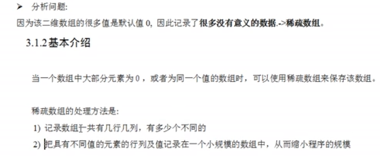

# JAVA数据结构和算法

## 稀疏数组

1.解决问题  

2.稀疏数组模型及思路分析


```java
package com.datastructure;

public class tests {
    void spareArray() {
        int[][] arr = new int[11][11];
        arr[1][2] = 1;
        arr[2][3] = 2;
        System.out.println("原始二维数组");

        //遍历数组，得到非0的数据的个数
        int sum = 0;
        for (int[] row : arr) {
            for (int data : row) {
                System.out.printf("%d\t", data);
                if (data != 0) {
                    sum++;
                }
            }
            System.out.println();
        }

        //创建稀疏数组
        int[][] sparseArray = new int[sum + 1][sum + 1];
        sparseArray[0][0] = arr.length;//二维数组的行
        sparseArray[0][1] = arr[0].length;//二维数组的列
        sparseArray[0][2] = sum;           //二维数组不为0的个数
        //记录不为0的数值的所在的位置
        int count = 0;
        for (int i = 0; i < arr.length; i++) {
            for (int j = 0; j < arr[i].length; j++) {
                if (arr[i][j] != 0) {
                    count++;
                    sparseArray[count][0] = i;
                    sparseArray[count][1] = j;
                    sparseArray[count][2] = arr[i][j];
                }
            }
        }
        System.out.println();
        System.out.println("原始二维数组转换得到的稀疏数组");
        for (int[] row : sparseArray) {
            for (int data : row) {
                System.out.printf("%d\t", data);
            }
            System.out.println();
        }

        //将稀疏数组在转原始数组
        int[][] arr2 = new int[sparseArray[0][0]][sparseArray[0][1]];
        for (int i = 1; i < sparseArray.length; i++) {
            arr2[sparseArray[i][0]][sparseArray[i][1]] = sparseArray[i][2];
        }

        System.out.println("x疏数组转换的二维数组");
        for (int[] row : arr2) {
            for (int data : row) {
                System.out.printf("%d\t", data);
            }
            System.out.println();
        }
    }
}
```  

## 数组模拟队列

1.银行排队系统 2.队列是一个有序列表,遵循先进先出


### 数组模拟队列案例

```java
package com.datastructure;

import javax.management.RuntimeErrorException;
import java.util.Scanner;

public class test {
    public static void main(String[] args) {
        //spareArray();
        ArrayQueue arrayQueue = new ArrayQueue(5);
        char key = ' ';//接收用户输入
        Scanner scanner = new Scanner(System.in);
        boolean loop = true;
        while (loop) {
            System.out.println("s(show):显示队列");
            System.out.println("e(exit):退出程序");
            System.out.println("a(add):添加数据到队列");
            System.out.println("g(get):从队列取出数据");
            System.out.println("h(head):查看队列头数据");
            key = scanner.next().charAt(0);
            switch (key) {
                case 's':
                    arrayQueue.showQueue();
                    break;
                case 'a':
                    System.out.println("输入一个数");
                    try {
                        int n = scanner.nextInt();
                        arrayQueue.addQueue(n);
                    } catch (Exception e) {
                        System.out.println(e.getMessage());
                    }
                    break;
                case 'g':
                    try {
                        int q = arrayQueue.removeQueue();
                        System.out.printf("取出来的的数据是%d\n", q);
                    } catch (Exception e) {
                        System.out.println(e.getMessage());
                    }

                    break;
                case 'h':
                    try {
                        int q = arrayQueue.headQueue();
                        System.out.printf("取出来的的数据是%d\n", q);
                    } catch (Exception e) {
                        System.out.println(e.getMessage());
                    }
                    break;
                case 'e':
                    System.exit(0);
                    break;
            }
        }
        System.out.println("程序退出");
    }
}

class ArrayQueue {

    //数组模拟队列
    int arrayMax;//队列最大值
    int front;//队列头
    int rear;//队列尾
    int[] arr;//模拟队列的数组

    public ArrayQueue(int arrayMaxSize) {
        arrayMax = arrayMaxSize;
        arr = new int[arrayMaxSize];
        front = -1;
        rear = -1;
    }

    /**
     * 判断队列是否满了
     */
    public boolean isFull() {
        return front == arrayMax - 1;
    }

    /**
     * 判断队列是否空
     */
    public boolean isEmpty() {
        return front == rear;
    }

    /**
     * 队列取数
     */
    public int removeQueue() {
        if (isEmpty()) {
            throw new RuntimeException("队列空，不能取数据");
        }
        front++;
        return arr[front];
    }

    /**
     * 添加数进入队列
     *
     * @param n
     */
    public void addQueue(int n) {
        if (isFull()) {
            System.out.println("队列满了");
            return;
        }
        rear++;
        arr[rear] = n;
    }

    /**
     * 显示队列
     */
    public void showQueue() {
        if (isEmpty()) {
            System.out.println("队列空,无数据");
            return;
        }
        for (int i = 0; i < arr.length; i++) {
            System.out.printf("arr[%d] = %d", i, arr[i]);
        }
    }

    /**
     * 队列头数据
     */
    public int headQueue() {
        if (isEmpty()) {
            throw new RuntimeException("队列空，不能取数据");
        }
        return arr[front + 1];
    }
}

```

### 问题 数组不能复用，使用一次就不能使用了，没有达到循环使用的作用

#### 使用数组模拟环形队列


```java
package com.datastructure;

import java.util.Scanner;

public class test {
    public static void main(String[] args) {
        //spareArray();
        CircleQueue arrayQueue = new CircleQueue(3);
        char key = ' ';//接收用户输入
        Scanner scanner = new Scanner(System.in);
        boolean loop = true;
        while (loop) {
            System.out.println("s(show):显示队列");
            System.out.println("e(exit):退出程序");
            System.out.println("a(add):添加数据到队列");
            System.out.println("g(get):从队列取出数据");
            System.out.println("h(head):查看队列头数据");
            key = scanner.next().charAt(0);
            switch (key) {
                case 's':
                    arrayQueue.showQueue();
                    break;
                case 'a':
                    System.out.println("输入一个数");
                    try {
                        int n = scanner.nextInt();
                        arrayQueue.addQueue(n);
                    } catch (Exception e) {
                        System.out.println(e.getMessage());
                    }
                    break;
                case 'g':
                    try {
                        int q = arrayQueue.removeQueue();
                        System.out.printf("取出来的的数据是%d\n", q);
                    } catch (Exception e) {
                        System.out.println(e.getMessage());
                    }

                    break;
                case 'h':
                    try {
                        int q = arrayQueue.headQueue();
                        System.out.printf("取出来的的数据是%d\n", q);
                    } catch (Exception e) {
                        System.out.println(e.getMessage());
                    }
                    break;
                case 'e':
                    System.exit(0);
                    break;
            }
        }
        System.out.println("程序退出");
    }
}

class CircleQueue {

    //数组模拟队列
    int arrayMax;//队列最大值
    int front;//指向队列的第一个元素,默认为0
    int rear;//指向队列的最后的一个元素的后一个位置,空出一个空间做约定,队列满时（rear + 1)%arrayMax=front;队列空rear == front
    int[] arr;//模拟队列的数组

    public CircleQueue(int arrayMaxSize) {
        arrayMax = arrayMaxSize;
        arr = new int[arrayMaxSize];
        front = 0;
        rear = 0;
    }

    /**
     * 判断队列是否满了
     */
    public boolean isFull() {
        return front == (rear + 1) % arrayMax;
    }

    /**
     * 判断队列是否空
     */
    public boolean isEmpty() {
        return front == rear;
    }

    /**
     * 队列取数
     */
    public int removeQueue() {
        if (isEmpty()) {
            throw new RuntimeException("队列空，不能取数据");
        }
        //先用value先保存front数组位置的值
        //然后对front + 1,取模防止数组越界
        //然后返回value
        int value = arr[front];
        front = (front + 1) % arrayMax;
        return value;
    }

    /**
     * 添加数进入队列
     *
     * @param n
     */
    public void addQueue(int n) {
        if (isFull()) {
            System.out.println("队列满了");
            return;
        }
        arr[rear] = n;
        //rear是队列最后一个位置 + 1，所有需要取模，否则会数组越界
        rear = (rear + 1) % arrayMax;
    }

    /**
     * 显示队列
     */
    public void showQueue() {
        if (isEmpty()) {
            System.out.println("队列空,无数据");
            return;
        }
        System.out.printf("front[%d] = rear[%d] \n", front, rear);
        for (int i = front; i < front + size(); i++) {
            //i % arrayMax 因为是环形队列，所有需要取模，防止数组越界
            System.out.printf("arr[%d] = %d \n", i % arrayMax, arr[i % arrayMax]);
        }
    }

    /**
     * 环形数组有效的数据的个数
     */
    public int size() {
        return (rear + arrayMax - front) % arrayMax;
    }

    /**
     * 队列头数据
     */
    public int headQueue() {
        if (isEmpty()) {
            throw new RuntimeException("队列空，不能取数据");
        }
        return arr[front];
    }
}
```

## 链表

1.链表介绍,以节点方式来存储，是链式存储,  
2.每个节点包含data域，next域：指向下一个节点,  
3.链表的各个节点不一定是连续存储  


### 单链表应用实列

1.使用带head头的单链表来实现-水浒英雄排行榜

#### 单链表思路分析


#### 单链表按顺序添加节点并显示

```java
package com.datastructure;

import java.util.Scanner;

public class test {
    public static void main(String[] args) {
        SinglelinkedList singlelinkedList = new SinglelinkedList();
        //添加节点
        HeroNoad heroNoad = new HeroNoad(1, "宋江", "及时雨");
        singlelinkedList.add(heroNoad);
        HeroNoad heroNoad1 = new HeroNoad(2, "卢俊义", "玉麒麟");
        singlelinkedList.add(heroNoad1);
        HeroNoad heroNoad2 = new HeroNoad(3, "吴用", "智多星");
        singlelinkedList.add(heroNoad2);
        HeroNoad heroNoad4 = new HeroNoad(4, "林冲", "豹子头");
        singlelinkedList.add(heroNoad4);
        //显示
        singlelinkedList.list();
    }
}

//定义一个SinglelinkedList来管理英雄人物
class SinglelinkedList {
    private HeroNoad head = new HeroNoad(0, "", "");//头节点不添加具体的数据

    /**
     * 添加节点到单向链表
     * 思路，不考虑链表编号顺序时
     * 1.找到当前链表最后一个节点
     * 2.将最后节点的next指向新的节点
     */
    public void add(HeroNoad heroNoad) {
        //因为Head节点不能动，所有需要一个辅组遍历temp
        HeroNoad temp = head;
        //遍历列表，找到最后
        while (true) {
            if (temp.next == null) {
                break;
            }
            temp = temp.next;
        }
        //当退出while循环时，就指向了链表的最后
        temp.next = heroNoad;
    }

    //显示列表(遍历)
    public void list() {

        //先判断链表是否为空
        if (head.next == null) {
            System.out.println("链表为空");
            return;
        }
        //因为Head节点不能动，所有需要一个辅组遍历temp
        HeroNoad temp = head.next;
        while (true) {
            System.out.println(temp.toString());
            if (temp.next == null) {
                break;
            }
            temp = temp.next;

        }
    }

}

class HeroNoad {
    public int no;
    public String name;
    public String nikeName;
    public HeroNoad next;

    public HeroNoad(int no, String name, String nikeName) {
        this.no = no;
        this.name = name;
        this.nikeName = nikeName;
    }

    @Override
    public String toString() {
        return "HeroNoad{" +
                "no=" + no +
                ", name='" + name + '\'' +
                ", nikeName='" + nikeName + '\'' +
                '}';
    }
}
```

#### 单链表按编号添加节点并显示

1.分析 1.单链表按排名添加

2.删除节点思路


#### 单链表增删改查

```java
package com.datastructure;

import java.util.Scanner;

public class test {
    public static void main(String[] args) {
        SinglelinkedList singlelinkedList = new SinglelinkedList();
        //添加节点
        HeroNoad heroNoad = new HeroNoad(1, "宋江", "及时雨");
        singlelinkedList.orderBy(heroNoad);
        HeroNoad heroNoad4 = new HeroNoad(4, "林冲", "豹子头");
        singlelinkedList.orderBy(heroNoad4);
        HeroNoad heroNoad1 = new HeroNoad(2, "卢俊义", "玉麒麟");
        singlelinkedList.orderBy(heroNoad1);
        HeroNoad heroNoad2 = new HeroNoad(3, "吴用", "智多星");
        singlelinkedList.orderBy(heroNoad2);


        //显示
        singlelinkedList.list();
        //修改节点
        HeroNoad heroNoad6 = new HeroNoad(4, "白猫", "白毛头");
        singlelinkedList.update(heroNoad6);
        System.out.println("修改后的链表");
        //显示
        singlelinkedList.list();

        //删除编号为4的节点
        System.out.println("删除编号为4321的节点后的链表");
        singlelinkedList.remove(4);
        singlelinkedList.remove(3);
        singlelinkedList.remove(2);
        singlelinkedList.remove(1);
        //显示
        singlelinkedList.list();
    }
}

//定义一个SinglelinkedList来管理英雄人物
class SinglelinkedList {
    private HeroNoad head = new HeroNoad(0, "", "");//头节点不添加具体的数据

    /**
     * 添加节点到单向链表
     * 思路，不考虑链表编号顺序时
     * 1.找到当前链表最后一个节点
     * 2.将最后节点的next指向新的节点
     */
    public void add(HeroNoad heroNoad) {
        //因为Head节点不能动，所有需要一个辅组遍历temp
        HeroNoad temp = head;
        //遍历列表，找到最后
        while (true) {
            if (temp.next == null) {
                break;
            }
            temp = temp.next;
        }
        //当退出while循环时，就指向了链表的最后
        temp.next = heroNoad;
    }

    //删除节点
    public void remove(int no) {
        if (head.next == null) {
            System.out.println("链表为空");
            return;
        }
        //因为Head节点不能动，所有需要一个辅组遍历temp
        HeroNoad temp = head;
        boolean flag = false;//判断是否找到
        while (true) {
            if (temp.next == null) {
                //链表已经遍历结束了
                break;
            }
            if (temp.next.no == no) {
                //找到了
                flag = true;
                break;
            }

            temp = temp.next;
        }
        if (flag) {
            temp.next = temp.next.next;
        } else {
            System.out.printf("没有找到编号为%d的节点 \n", no);
        }
    }

    //修改节点信息,根据编号来修改信息,编号不能改
    public void update(HeroNoad newHeroNoad) {
        if (head.next == null) {
            System.out.println("链表为空");
            return;
        }
        //因为Head节点不能动，所有需要一个辅组遍历temp
        HeroNoad temp = head;
        boolean flag = false;//判断是否找到
        while (true) {
            if (temp.next == null) {
                //链表已经遍历结束了
                break;
            }
            if (temp.next.no == newHeroNoad.no) {
                //找到了
                flag = true;
                break;
            }
            temp = temp.next;
        }
        if (flag) {
            temp.name = newHeroNoad.name;
            temp.nikeName = newHeroNoad.nikeName;
        } else {
            System.out.printf("没有找到编号为%d的节点 \n", newHeroNoad.no);
        }
    }

    //第二种添加方式,按排名将英雄添加到指定位置
    //如果没有排名，则显示添加失败
    public void orderBy(HeroNoad heroNoad) {
        //因为头节点不能动,所有需要辅组节点temp来帮助找到添加的位置
        //因为单链表，我们找的temp是位于添加位置的前一个节点，否则插入不了
        HeroNoad temp = head;
        boolean flag = false;//标识英雄添加的编号是否存在，默认为false值
        while (true) {
            if (temp.next == null) {//说明temp已经到链表最后
                break;
            }
            if (temp.next.no > heroNoad.no) {
                //位置找到了，就在temp直接插入
                break;
            } else if (temp.next.no == heroNoad.no) {
                flag = true;
                break;
            }
            temp = temp.next;
        }
        if (temp.no == heroNoad.no) {
            flag = true;
        }
        if (flag) {
            System.out.printf("准备插入的编号%d已经存在\n", heroNoad.no);
        } else {
            heroNoad.next = temp.next;
            temp.next = heroNoad;
        }
    }

    //显示列表(遍历)
    public void list() {

        //先判断链表是否为空
        if (head.next == null) {
            System.out.println("链表为空");
            return;
        }
        //因为Head节点不能动，所有需要一个辅组遍历temp
        HeroNoad temp = head.next;
        while (true) {
            System.out.println(temp.toString());
            if (temp.next == null) {
                break;
            }
            temp = temp.next;

        }
    }

}

class HeroNoad {
    public int no;
    public String name;
    public String nikeName;
    public HeroNoad next;

    public HeroNoad(int no, String name, String nikeName) {
        this.no = no;
        this.name = name;
        this.nikeName = nikeName;
    }

    @Override
    public String toString() {
        return "HeroNoad{" +
                "no=" + no +
                ", name='" + name + '\'' +
                ", nikeName='" + nikeName + '\'' +
                '}';
    }
}
```

### 单链表面试题

```java
package com.datastructure;


import java.util.Stack;

public class test {
    public static void main(String[] args) {
        SinglelinkedList singlelinkedList = new SinglelinkedList();
        //添加节点
        HeroNoad heroNoad = new HeroNoad(1, "宋江", "及时雨");
        singlelinkedList.orderBy(heroNoad);
        HeroNoad heroNoad4 = new HeroNoad(4, "林冲", "豹子头");
        singlelinkedList.orderBy(heroNoad4);
        HeroNoad heroNoad1 = new HeroNoad(2, "卢俊义", "玉麒麟");
        singlelinkedList.orderBy(heroNoad1);
        HeroNoad heroNoad2 = new HeroNoad(3, "吴用", "智多星");
        singlelinkedList.orderBy(heroNoad2);

        //1.显示链表有效节点个数
        int value = getLength(singlelinkedList.getHead());
        System.out.println(value + " individual");
        //2.查找倒数第K个节点
        HeroNoad lastHero = findLastIndexNode(singlelinkedList.getHead(), 1);
        System.out.println(lastHero.toString());

        //3.单链表的翻转
        System.out.println("反转列表");
        fanzhuan(singlelinkedList.getHead());
        singlelinkedList.list();
        //在反回来
        fanzhuan(singlelinkedList.getHead());
        //4.逆序打印单链表
        System.out.println("逆序打印单链表");
        reversePrint(singlelinkedList.getHead());
        System.out.println("链表结构打印");
        singlelinkedList.list();


        //5.合并两个有序的链表，合并后还是有序的
        SinglelinkedList singlelinkedList1 = new SinglelinkedList();
        HeroNoad heroNoad11 = new HeroNoad(5, "宋江1", "及时雨");
        singlelinkedList1.orderBy(heroNoad11);
        HeroNoad heroNoad22 = new HeroNoad(6, "林冲2", "豹子头");
        singlelinkedList1.orderBy(heroNoad22);
        HeroNoad heroNoad33 = new HeroNoad(7, "卢俊义3", "玉麒麟");
        singlelinkedList1.orderBy(heroNoad33);
        HeroNoad heroNoad44 = new HeroNoad(8, "吴用4", "智多星");
        singlelinkedList1.orderBy(heroNoad44);
        System.out.println("第二个链表打印");
        singlelinkedList1.list();

        System.out.println("合并后的链表");
        hebing(singlelinkedList, singlelinkedList1.getHead());
        singlelinkedList.list();

        System.out.println("第二个链表打印");
        singlelinkedList1.list();
    }

    //5.合并两个有序的链表，合并后还是有序的
    public static void hebing(SinglelinkedList singlelinkedList, HeroNoad head1) {
        HeroNoad temp = head1.next;
        HeroNoad next = null;
        while (temp != null) {
            next = temp.next;
            singlelinkedList.orderBy(temp);
            temp = next;
        }
    }

    /**
     * 面试题
     */
    //4.逆序打印单链表
    //利用栈的先进后出的原理，就能倒序输出
    public static void reversePrint(HeroNoad head) {
        if (head.next == null || head.next.next == null) {
            System.out.println("单链表为空或者只有一个节点");
            return;
        }
        Stack<HeroNoad> heroNoadStack = new Stack<>();
        HeroNoad temp = head.next;
        while (temp != null) {
            heroNoadStack.add(temp);
            temp = temp.next;
        }
        while (heroNoadStack.size() > 0) {
            System.out.println(heroNoadStack.pop());//特点，先进后出
        }
    }

    //3.单链表的反转
    public static void fanzhuan(HeroNoad head) {
        if (head.next == null || head.next.next == null) {
            System.out.println("单链表为空或者只有一个节点");
            return;
        }
        HeroNoad reverseHead = new HeroNoad(0, "", "");
        HeroNoad temp = head.next;//辅组变量，帮助我们遍历原来的链表
        HeroNoad next = null;//记录下一个节点，防止节点断开
        while (temp != null) {
            next = temp.next;//保存下一个节点
            temp.next = reverseHead.next;//将reverseHead.next 替换temp.next
            reverseHead.next = temp;//将temp替换到头节点的next
            temp = next;//将下一个节点给temp
        }
        head.next = reverseHead.next;//头节点替换
    }

    //2.查找倒数第K个节点

    /***
     *1.编写一个方法接收head节点
     * 2.index 是倒数第index节点
     * 3.先把链表从头到尾遍历一遍，得到链表的总长度getLength
     * 4.得到size后，我们从链表的第一个开始遍历（size - index)个，就可以得到
     * 5.如果找到了，就返回该节点，否则返回null
     */
    public static HeroNoad findLastIndexNode(HeroNoad head, int index) {
        //判断链表为空,返回null
        if (head.next == null) {
            return null;
        }
        int size = getLength(head);
        if (index < 0 || index > size) {
            return null;
        }
        HeroNoad temp = head.next;
        for (int i = 0; i < size - index; i++) {
            temp = temp.next;
        }
        return temp;
    }

    //1.显示链表有效节点个数
    public static int getLength(HeroNoad head) {
        if (head.next == null) {
            return 0;
        }
        int value = 0;
        HeroNoad temp = head.next;
        while (temp != null) {
            value++;
            temp = temp.next;
        }

        return value;
    }
}


//定义一个SinglelinkedList来管理英雄人物
class SinglelinkedList {
    private HeroNoad head = new HeroNoad(0, "", "");//头节点不添加具体的数据

    public HeroNoad getHead() {
        return head;
    }

    public void setHead(HeroNoad head) {
        this.head = head;
    }

    /**
     * 添加节点到单向链表
     * 思路，不考虑链表编号顺序时
     * 1.找到当前链表最后一个节点
     * 2.将最后节点的next指向新的节点
     */
    public void add(HeroNoad heroNoad) {
        //因为Head节点不能动，所有需要一个辅组遍历temp
        HeroNoad temp = head;
        //遍历列表，找到最后
        while (true) {
            if (temp.next == null) {
                break;
            }
            temp = temp.next;
        }
        //当退出while循环时，就指向了链表的最后
        temp.next = heroNoad;
    }

    //删除节点
    public void remove(int no) {
        if (head.next == null) {
            System.out.println("链表为空");
            return;
        }
        //因为Head节点不能动，所有需要一个辅组遍历temp
        HeroNoad temp = head;
        boolean flag = false;//判断是否找到
        while (true) {
            if (temp.next == null) {
                //链表已经遍历结束了
                break;
            }
            if (temp.next.no == no) {
                //找到了
                flag = true;
                break;
            }

            temp = temp.next;
        }
        if (flag) {
            temp.next = temp.next.next;
        } else {
            System.out.printf("没有找到编号为%d的节点 \n", no);
        }
    }

    //修改节点信息,根据编号来修改信息,编号不能改
    public void update(HeroNoad newHeroNoad) {
        if (head.next == null) {
            System.out.println("链表为空");
            return;
        }
        //因为Head节点不能动，所有需要一个辅组遍历temp
        HeroNoad temp = head;
        boolean flag = false;//判断是否找到
        while (true) {
            if (temp.next == null) {
                //链表已经遍历结束了
                break;
            }
            if (temp.next.no == newHeroNoad.no) {
                //找到了
                flag = true;
                break;
            }
            temp = temp.next;
        }
        if (flag) {
            temp.name = newHeroNoad.name;
            temp.nikeName = newHeroNoad.nikeName;
        } else {
            System.out.printf("没有找到编号为%d的节点 \n", newHeroNoad.no);
        }
    }

    //第二种添加方式,按排名将英雄添加到指定位置
    //如果没有排名，则显示添加失败
    public void orderBy(HeroNoad heroNoad) {
        //因为头节点不能动,所有需要辅组节点temp来帮助找到添加的位置
        //因为单链表，我们找的temp是位于添加位置的前一个节点，否则插入不了
        HeroNoad temp = head;
        boolean flag = false;//标识英雄添加的编号是否存在，默认为false值
        while (true) {
            if (temp.next == null) {//说明temp已经到链表最后
                break;
            }
            if (temp.next.no > heroNoad.no) {
                //位置找到了，就在temp直接插入
                break;
            } else if (temp.next.no == heroNoad.no) {
                flag = true;
                break;
            }
            temp = temp.next;
        }
        if (temp.no == heroNoad.no) {
            flag = true;
        }
        if (flag) {
            System.out.printf("准备插入的编号%d已经存在\n", heroNoad.no);
        } else {
            heroNoad.next = temp.next;
            temp.next = heroNoad;
        }
    }

    //显示列表(遍历)
    public void list() {

        //先判断链表是否为空
        if (head.next == null) {
            System.out.println("链表为空");
            return;
        }
        //因为Head节点不能动，所有需要一个辅组遍历temp
        HeroNoad temp = head.next;
        while (true) {
            System.out.println(temp.toString());
            if (temp.next == null) {
                break;
            }
            temp = temp.next;

        }
    }


}

class HeroNoad {
    public int no;
    public String name;
    public String nikeName;
    public HeroNoad next;

    public HeroNoad(int no, String name, String nikeName) {
        this.no = no;
        this.name = name;
        this.nikeName = nikeName;
    }

    @Override
    public String toString() {
        return "HeroNoad{" +
                "no=" + no +
                ", name='" + name + '\'' +
                ", nikeName='" + nikeName + '\'' +
                '}';
    }
}
```

## 双向链表
1.单链表的问题分析（只能查找一个方向,不能自我删除,删除某个节点，只能找到前一个节点，才能删除）  
1.双向链表生成图


## 约瑟夫问题 
1.分析

2.单向环形链表分析

```java
package com.datastructure;


import java.util.Stack;

public class test {
    public static void main(String[] args) {
        CircleSingListedList circleSingListedList = new CircleSingListedList();
        circleSingListedList.addBoy(5);
        circleSingListedList.showBoy();

    }

}

//创建一个环形的链表
class CircleSingListedList {
    //创建一个first节点
    private Boy first = new Boy(-1);

    public void addBoy(int nums) {
        //nums数据校验
        if (nums < 1) {
            System.out.println("nums的值不正确");
            return;
        }
        Boy curBoy = null;//辅组变量，帮助构建环形变量
        for (int i = 1; i <= nums; i++) {
            Boy boy = new Boy(i);
            if (i == 1) {
                first = boy;
                first.setNext(first);
                curBoy = first;//让curBoy指向第一个
            } else {
                curBoy.setNext(boy);//上一个节点next指向新的节点
                boy.setNext(first);//将新的节点next指向第一个节点
                //curBoy指向新节点
                curBoy = boy;

            }
        }
    }

    public void showBoy() {
        if (first == null) {
            System.out.println("链表为空，没有任何小孩");
            return;
        }
        //因为first不能动,所有需要辅组指针完成变量
        Boy curBoy = first;
        while (true) {
            System.out.println(curBoy.getNo() + "");
            if (curBoy.getNext() == first) {
                break;
            }
            curBoy = curBoy.getNext();
        }


    }
}

class Boy {
    private int no;
    private Boy next;


    public Boy(int no) {
        this.no = no;
    }

    public Boy getNext() {
        return next;
    }

    public void setNext(Boy next) {
        this.next = next;
    }

    public int getNo() {
        return no;
    }

    public void setNo(int no) {
        this.no = no;
    }
}
```
1.约瑟夫问题小孩出圈图解

```java
package com.datastructure;


import java.util.Stack;

public class test {
    public static void main(String[] args) {
        CircleSingListedList circleSingListedList = new CircleSingListedList();
        circleSingListedList.addBoy(5);
        circleSingListedList.showBoy();
        circleSingListedList.countBoy(1, 2, 2);
    }

}

//创建一个环形的链表
class CircleSingListedList {
    //创建一个first节点
    private Boy first = new Boy(-1);

    public void addBoy(int nums) {
        //nums数据校验
        if (nums < 1) {
            System.out.println("nums的值不正确");
            return;
        }
        Boy curBoy = null;//辅组变量，帮助构建环形变量
        for (int i = 1; i < nums; i++) {
            Boy boy = new Boy(i);
            if (i == 1) {
                first = boy;
                first.setNext(first);
                curBoy = first;//让curBoy指向第一个
            } else {
                curBoy.setNext(boy);//上一个节点next指向新的节点
                boy.setNext(first);//将新的节点next指向第一个节点
                //curBoy指向新节点
                curBoy = boy;

            }
        }
    }

    public void showBoy() {
        if (first == null) {
            System.out.println("链表为空，没有任何小孩");
            return;
        }
        //因为first不能动,所有需要辅组指针完成变量
        Boy curBoy = first;
        while (true) {
            System.out.println(curBoy.getNo() + "");
            if (curBoy.getNext() == first) {
                break;
            }
            curBoy = curBoy.getNext();
        }


    }

    /**
     * 出圈
     *
     * @param startNo 从第几个开始数数
     * @param endNO   结束数数
     * @param nums    数几次
     */
    public void countBoy(int startNo, int endNO, int nums) {
        if (first == null || startNo < 1 || endNO > nums) {
            System.out.println("参数有误，请重新输入");
            return;
        }
        Boy helpBoy = first;
        while (true) {
            if (helpBoy.getNext() == first) {//helpBoy指向最后一个节点
                break;
            }
            helpBoy = helpBoy.getNext();

        }
        for (int i = 0; i < startNo - 1; i++) {
            first = first.getNext();
            helpBoy = helpBoy.getNext();
        }
        //从startNo开始数nums个数，第nums个出圈,循环数，直到最后
        while (true) {
            if (helpBoy == first) {
                break;
            }
            for (int i = 0; i < nums - 1; i++) {
                first = first.getNext();
                helpBoy = helpBoy.getNext();
            }
            System.out.printf("第%d个小孩出圈 \n", first.getNo());
            first = first.getNext();
            helpBoy.setNext(first);
        }
    }
}

class Boy {
    private int no;
    private Boy next;


    public Boy(int no) {
        this.no = no;
    }

    public Boy getNext() {
        return next;
    }

    public void setNext(Boy next) {
        this.next = next;
    }

    public int getNo() {
        return no;
    }

    public void setNo(int no) {
        this.no = no;
    }
}


```


